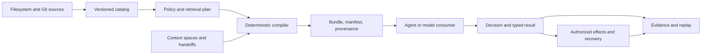

# CIGAR

**Context Intelligence Graph Agentic Runtime**

Governed context, bounded agent authority, and replayable evidence for AI agent workflows.

CIGAR is an open protocol developed by [HOL](https://hol.org).

**Local context graphs work without HOL services, an account, API keys, a daemon, or a database.**
Use `LocalContextGraph` from Python's `cigar_sdk` or npm's `@hol-org/cigar/context`.
Both packages run a bundled Rust worker locally; their separate `CigarClient`
APIs connect to a caller-selected CIGAR server.

[0.12 improvements](#improvements-in-0120) · [Local Python quickstart](#local-python-quickstart) ·
[Local npm quickstart](#local-npm-quickstart) · [Why CIGAR?](#why-cigar) · [Get started](#get-started) · [How it works](#how-it-works) ·
[0.9.4 candidate](#cigar-honey-094-candidate) · [Candidate evidence](#094-candidate-evidence) ·
[Release gates](#094-candidate-release-gates) ·
[Documentation](#documentation) ·
[Security](#security)

> [!IMPORTANT]
> The separate runtime profile documented below is **CIGAR Honey 0.9.4 candidate** (`0.9.4`). Its Python
> development distribution is `hol-cigar==0.9.4`. This is unsupported evaluation software: it is not
> production-qualified, signed, or notarized. See [current status](#current-status) and the exact
> [candidate release gates](#094-candidate-release-gates) before evaluating it.

## Improvements in 0.12.0

The Python release improves startup, integrity validation and worker cleanup while
preserving the existing context ABI, valid canonical IDs and all 69 public Python
exports. Compared with published 0.11.0:

| Measure | 0.11.0 | 0.12.0 |
| --- | --- | --- |
| Python local API import, median | 59.06 ms | 6.50 ms (89% lower) |
| Python import plus first graph, median | 109.72 ms | 62.83 ms (43% lower) |
| Worker-hashing Python allocation | 7.29 MB | 1.18 MB (84% lower) |
| Ambiguous mapping keys in semantic integrity data | Could lose entries before hashing | Rejected before conversion |
| Protobuf requirement | Exactly 6.33.5 | Tested range `>=6.33.5,<8` |

Worker shutdown now preserves primary errors, handles concurrent cleanup and
rejects inherited graph use after `fork()`. Package qualification adds Python
branch-coverage gates, API snapshots and dependency evidence derived from actual
installed artifacts. Native wheels work without HOL services or a Rust compiler.

Timings are from one macOS ARM64 host with Python 3.14.7, equal protobuf versions,
warm filesystem/bytecode caches and 25 fresh-process samples per startup case.
Steady-state compilation was essentially unchanged. Some native benchmark
medians increased up to 7.4%, one microsecond-scale p95 increased 26%, and native
process RSS increased up to 3.5%; passing the regression thresholds does not mean
every metric improved. Offline answer-review outcomes were unchanged and do not
establish a real-model hallucination reduction.

See the [full comparison, tradeoffs and qualification scope](docs/release/context-sdk-0.12.0-comparison.md)
and [Python changelog](sdk/python/CHANGELOG.md). The qualified npm 0.12.0 archive
also fixes canonical-CBOR union response decoding, including `publishSpace`;
its npm registry publication is separate from this Python release.

## Local Python quickstart

Use Python 3.14 on a supported native platform:

```sh
python3.14 -m pip install --upgrade 'hol-cigar==0.12.0'
python3.14 -m cigar_sdk.local_cli doctor
python3.14 -m cigar_sdk.local_cli demo
```

The [Python guide](sdk/python/README.md) covers ingestion, exact context budgets,
citations, source updates and answer review. A normal wheel install bundles the
worker; deliberate workerless source builds require explicit opt-in and a trusted
matching worker path.

## Local npm quickstart

The npm package name is **`@hol-org/cigar`**. `hol-cigar` is the Python distribution name.
The current npm registry release is 0.11.0 and includes local context graphs:

```sh
npm install --save-exact @hol-org/cigar@0.11.0
```

Use **Node.js >=24.10.0 <25** on macOS ARM64/x64, Linux ARM64/x64 with glibc or musl,
or Windows x64. Save this as
`context.mjs` and run `node context.mjs`:

```js
import { LocalContextGraph } from "@hol-org/cigar/context";

const graph = await LocalContextGraph.create("my-project");
try {
  await graph.replaceSource("docs/retries.md", [
    {id: "retry-policy", source: "docs/retries.md", text: "Retry at most three times."},
  ]);
  const result = await graph.compile({query: "retry", max_tokens: 512, reserve_tokens: 64});
  console.log(result.rendered);
} finally {
  await graph.close();
}
```

Keep the graph open across requests in your application to reuse its indexes and token cache.
Supply document text yourself; `source` is a citation locator and does not open a file.

The published 0.11.0 package includes compact prompt citations and answer review.
Use its [versioned TypeScript guide](https://github.com/hashgraph-online/hol-cigar/blob/v0.11.0/sdk/typescript/README.md).
The [0.12.0 TypeScript guide](sdk/typescript/README.md) describes the separately
qualified npm archive, which is not yet the npm registry default.

## Why CIGAR?

Agent systems routinely assemble context, call tools, hand work to other agents, and retry after
partial failures. Without an explicit runtime contract, those operations are difficult to govern or
reproduce: source text can blur into instruction authority, prompt construction becomes invisible,
tool outcomes are mistaken for certainty, and audit logs omit the context that shaped a decision.

CIGAR makes that decision environment explicit. It sits between source systems and an agent or
model runtime and provides:

- deterministic, provenance-bearing context bundles instead of opaque prompt concatenation;
- policy enforcement before protected content is disclosed;
- recipient-bound handoffs with attenuated authority and typed result merging;
- durable effect intent, authorization, dispatch, reconciliation, and compensation;
- evidence reproduction and no-egress observational replay; and
- content-safe operational signals without storing hidden model reasoning.

CIGAR is model-agnostic. It is not a model, hosted agent service, autonomous scheduler, or replacement
for an application-specific orchestrator.

## What can you evaluate?

| Workflow | What CIGAR demonstrates |
|---|---|
| Governed context compilation | Observe filesystem or Git sources, apply policy and budgets, and produce a stable bundle with a manifest and provenance. |
| Two-agent collaboration | Fork private work, issue a signed and attenuated handoff, accept it once, and merge a typed result against an exact base. |
| Recoverable external actions | Record intent before dispatch, preserve `UNKNOWN` after ambiguous execution, then reconcile or compensate explicitly. |
| Replay and audit | Reconstruct declared inputs, verify retained evidence, or replay recorded observations without contacting a live provider. |
| Local agent integration | Use the CLI, embedded runtime, local daemon, MCP server, Claude Code adapter, or language SDKs. |

## Get started

Choose the path that matches what you are trying to do:

| Goal | Start here |
|---|---|
| Create a local context graph from npm | Follow the [local npm quickstart](#local-npm-quickstart); no HOL services are required. |
| Create a local context graph from Python | Install `hol-cigar==0.12.0` from PyPI; follow the [Python quickstart](#local-python-quickstart). |
| Connect to an existing CIGAR server from TypeScript | Use the compatible remote client; inspect the [`@hol-org/cigar@0.9.4` release assessment](reports/npm-sdk-0.9.4-readiness.md) for its exact scope and verification evidence. |
| Evaluate the private Honey 0.9.4 candidate | [Install Honey](docs/guides/honey-install.md), then run the [offline context quickstart](docs/guides/honey-quickstart.md). |
| Understand the security model first | Read [Honey security and limitations](docs/guides/honey-security-limitations.md). |
| Try agent coordination | Follow the [two-agent workflow](docs/guides/honey-two-agent.md). |
| Try MCP or Claude Code | Follow the [MCP and Claude Code guide](docs/guides/honey-mcp-claude.md). |
| Build or contribute from source | Install the versions in [`support.toml`](support.toml), then use the commands below. |

```sh
cargo xtask bootstrap
cargo xtask test unit
```

`bootstrap` validates required tools and generated artifacts. It does not install software or fetch
missing dependencies. Tests are expected to remain hermetic and offline.

## How it works



1. **Observe sources.** Filesystem and Git connectors discover content under explicit source
   identities, exclusions, lifecycle rules, and integrity metadata.
2. **Plan under policy.** A context contract fixes purpose, principal, projects, consistency,
   trust constraints, token lanes, compiler profile, and catalog watermark.
3. **Compile deterministically.** CIGAR sorts, deduplicates, filters, budgets, materializes, and
   hashes selected context into an immutable bundle and manifest.
4. **Coordinate bounded work.** Context spaces preserve immutable bases, private overlays,
   checkpoints, signed handoffs, typed changes, and explicit conflicts.
5. **Handle actions as effects.** External mutation is separated into intent, authorization,
   dispatch, observation, reconciliation, and compensation. Ambiguous execution remains `UNKNOWN`.
6. **Retain observable evidence.** Decisions bind inputs, policy, context, runtime fingerprints,
   outputs, effects, observations, and uncertainty without requesting hidden chain-of-thought.

The public protocol currently defines seven services covering catalog, context, spaces, handoffs,
effects, replay, and operations. See the [public API reference](docs/reference/public-api.md) for the
operation-level contract.

## 0.11.0 local context background

Version 0.11.0 shipped [`cigar-context`](https://github.com/hashgraph-online/hol-cigar/tree/v0.11.0/crates/cigar-context), with
matching Python and TypeScript SDKs. It added a bounded answer-review contract:
current authorized evidence, exact claim/snapshot bindings, independently supplied
trusted verdicts, citation checks, distinct source groups and explicit counterevidence.
Unreviewed or unsupported claims cannot pass merely by reporting high confidence.
The host supplies and evaluates its semantic reviewer; CIGAR does not certify truth.

The [measurement plan](docs/proposals/cigar-0.11.0-plan.md) defines release gates.
The [answer-quality tools](benches/answer-quality/README.md) provide explicit
factuality, citation, abstention, calibration and efficiency metrics. Synthetic
contract tests do not establish live-model hallucination reduction.

Start with `python3 scripts/dev.py context`. See the
[release notes](docs/release/context-sdk-0.11.0-notes.md),
[Python guide](sdk/python/README.md), and [TypeScript guide](sdk/typescript/README.md).
The [distribution work](docs/proposals/cigar-0.11.0-distribution.md) introduced seven-platform
workers, installed diagnostics, a complete local workflow and agent instructions for
npm/PyPI. The Honey history below retains its original 0.9.4 identity.

## CIGAR Honey 0.9.4 candidate

Honey is the first bounded CIGAR profile intended for hands-on local evaluation. The private 0.9.4
candidate adds the explicit `balanced_v4` profile: risk-aware ranking protects blocking and
effect-adjacent evidence, exact-token packing stops when marginal utility is exhausted, and dense
request-scoped state reduces repeated ranking and compiler work. During qualification, an omitted
profile still selects frozen `balanced_v3`; `balanced_v1` remains selectable for exact 0.9.2 replay.
The candidate remains a developer preview, not a supported service or security certification.

### Selected scope

- Apple-silicon macOS (`aarch64-apple-darwin`);
- embedded and local-sidecar deployment modes;
- one local operating-system user with explicit CIGAR agent principals;
- filesystem and Git ingestion;
- a local filesystem reference effect;
- CLI, local daemon, MCP, and Claude Code workflows;
- direct Python and TypeScript packages plus an offline Rust local-registry kit; and
- deterministic workflows that need neither a model provider nor network access.

### Explicitly deferred

- Linux, Windows, and Intel macOS release support;
- remote multi-tenancy and shared PostgreSQL/S3 deployment;
- containers, Kubernetes, Homebrew, crates.io publication, and PyPI publication outside the
  separately bounded `hol-cigar` SDK profile; public npm remains separately approval-gated by the
  `@hol-org/cigar` profile;
- HTTPS effects, arbitrary extensions, live-provider replay, and remote OTLP;
- vector retrieval in the selected release profile;
- generalized model-provider completion or cross-workload performance claims; and
- production support, Apple signing/notarization, long-duration qualification, and GA guarantees.

The repository contains implementation and design work beyond Honey. Code presence does not imply
that a surface is selected, packaged, qualified, published, or supported by this release profile.

## 0.9.4 candidate evidence

The independent Hiero Pentest RC comparison ran five governed workflows with 50 measured trials per
workflow and treatment: 250 observations for each of 0.9.2, 0.9.3, and 0.9.4, plus registered
warmups. Treatments were release-built from immutable commits, interleaved in randomized blocks,
and executed against a recorded provider under network denial.

| Metric | 0.9.2 / `balanced_v1` | 0.9.3 / `balanced_v3` | 0.9.4 / `balanced_v4` |
|---|---:|---:|---:|
| Valid completion and blocking/gold/citation coverage | 100% | 100% | **100%** |
| Useful-selection precision | 27.1% | 50.0% | **100%** |
| Semantic duplicate rate | 46.1% | 0% | **0%** |
| Mean exact selected tokens | 2,251.05 | 1,251.78 | **625.40** |
| Internal CIGAR pipeline p50 | 2.049 ms | 1.852 ms | **0.738 ms** |
| Internal CIGAR pipeline p95 | 7.658 ms | 3.268 ms | **1.216 ms** |

All 44 evaluated claims passed. Relative to 0.9.3, 0.9.4 used 50.039% fewer exact tokens and
reduced mean internal CIGAR pipeline latency by 59.627%; every workflow independently reduced mean
tokens by approximately 50%. The separately evaluated 128/512 allocation gate is not inferred from
this workflow cohort.

These are deterministic, source-bound measurements—not final installed-artifact, live-model,
security-certification, or universal performance claims. See the
[full Hiero three-way report](docs/release/honey-0.9.4-hiero-three-way-comparison.md) and
[0.9.4 candidate release notes](RELEASE_NOTES_HONEY_v0.9.4.md). The retained evidence ID is
`ae0abda8daa92a00b1c5e1d75b947ee35d9abc75ef7364be0549558ad7b5c1e4`.

## Current status

The checked-in product authority currently declares:

| Property | Value |
|---|---|
| Project | [HOL.org](https://hol.org) alpha project |
| Marketing name | CIGAR Honey 0.9.4 candidate |
| Version | `0.9.4` |
| Python distribution | `hol-cigar==0.9.4` (import `cigar_sdk`) |
| TypeScript npm distribution | `@hol-org/cigar@0.9.4` (published developer preview; intended `alpha` channel) |
| Context ABI | `cigar.context.v1` |
| Release state | Alpha / `developer-preview` |
| Target | `aarch64-apple-darwin` |
| Publication | Not published |
| Support | Unsupported evaluation software |
| Production qualification | False |
| Signing and notarization | Not included |

The Honey artifact profile defines a closed 13-file candidate inventory with checksum and structural
verification. Final qualification evidence is not complete, so artifact integrity must not be
reported as production qualification.

Machine-readable authorities take precedence over prose:

- [`packaging/product-version.v1.json`](packaging/product-version.v1.json) — version and publication state;
- [`packaging/honey/capability-profile.v1.json`](packaging/honey/capability-profile.v1.json) — selected capabilities and platform;
- [`packaging/honey/artifact-matrix.v1.json`](packaging/honey/artifact-matrix.v1.json) — exact artifact inventory; and
- [`packaging/honey/release-requirements.v1.json`](packaging/honey/release-requirements.v1.json) — mandatory gates and prohibited claims.
- [`packaging/pypi/release-profile.v1.json`](packaging/pypi/release-profile.v1.json) — the separate
  `hol-cigar` 0.9.1 PyPI developer-preview identity and bounded qualification gates.
- [`packaging/npm/release-profile.v1.json`](packaging/npm/release-profile.v1.json) — the separate
  `@hol-org/cigar` npm identity, published canonical bytes, terminal 0.9.4 state, and future
  staged-publication controls.

Progress toward the broader CIGAR v1 design is tracked in
[`IMPLEMENTATION_STATUS.md`](IMPLEMENTATION_STATUS.md) against [`prd.md`](prd.md). Those planning
documents do not expand Honey's release claims.

## 0.9.4 candidate release gates

The candidate cut uses a scoped, fail-closed distribution gate. It establishes that the exact source
and package bytes are internally consistent and installable; it does not establish production
readiness or a conclusive efficiency or efficacy claim.

| Gate | Required result before release |
|---|---|
| Frozen source | One clean committed revision and tree, no Git replacement objects, consistent product/Honey authority, generated clients, contracts, and documentation. |
| Regression checks | Python SDK tests, lint, formatting, and strict typing; release-tool regression tests; documentation checks; Rust workspace tests and warnings-denied Clippy. |
| Exact artifacts | The closed 13-file Honey inventory is rebuilt from the frozen commit; every contract and checksum passes; the public verifier returns `passed-artifact-integrity`. |
| Python package | The `hol_cigar-0.9.4` wheel and sdist pass strict metadata checks and clean Python 3.14 installs in the non-admin qualification environment. Imports, the 45-operation surface, shared fixture, and both entry points must pass. |
| TypeScript npm package | `@hol-org/cigar@0.9.4` is published and matches the qualified archive byte-for-byte. Exact metadata and archive checks, two-pack reproducibility, strict types, runtime tests, clean packed consumers, live-registry install, and production audit passed. The registry unexpectedly also assigned `latest`; that tag-policy exception is recorded in the npm release assessment. |
| Publication control | The tag resolves to the frozen commit; GitHub prerelease downloads match the manifest; PyPI uses the protected `pypi` environment, Trusted Publishing, attestations, and explicit owner approval. A clean post-publication install and published hashes must match. |

Installed-artifact workflow qualification, upgrade and rollback rehearsal, final reproducibility,
long-running fuzz/sanitizer/soak campaigns, signing, and notarization remain separate work. No
candidate package may imply they passed. The public manifest must continue to report
`supported=false` and `production_qualified=false`.

## Repository map

| Path | Contents |
|---|---|
| `crates/` | Rust protocol, catalog, compiler, policy, space, effects, replay, storage, API, daemon, CLI, MCP, and support crates. |
| `sdk/` | Python, TypeScript, Rust, and Go SDK source and contract tests. Go is not selected for Honey packaging. |
| `adapters/`, `connectors/` | Claude Code and source-system integrations. |
| `spec/`, `schemas/`, `proto/` | Versioned operations, payloads, schemas, and transport contracts. |
| `conformance/` | Conformance runners, vectors, and install qualification tools. |
| `demos/` | Deterministic Honey context, handoff, effect, replay, and injection-defense scenarios. |
| `packaging/`, `scripts/release/` | Product authority, artifact producers, verifiers, and qualification workflows. |
| `docs/` | Guides, API reference, operations, troubleshooting, release verification, and design documentation. |
| `artifacts/`, `reports/` | Implementation and test records; not automatically evidence for a later source revision. |

## Documentation

- [Documentation index](docs/README.md)
- [Core concepts](docs/guides/concepts.md)
- [Honey installation](docs/guides/honey-install.md)
- [Honey offline quickstart](docs/guides/honey-quickstart.md)
- [Handoffs, effects, and replay](docs/guides/handoffs-effects-replay.md)
- [SDK guides](docs/guides/sdks.md)
- [Operations](docs/operations/index.md)
- [Troubleshooting](docs/troubleshooting/index.md)
- [Release verification](docs/release/verification.md)
- [`@hol-org/cigar` 0.9.4 npm readiness](reports/npm-sdk-0.9.4-readiness.md)
- [Artifact-oriented Honey README](README_HONEY.md)

## Security

Honey's authority, integrity, and traceability controls operate inside a single local-user trust
boundary. They are not process isolation between mutually hostile programs running as that user.
Review [Honey security and limitations](docs/guides/honey-security-limitations.md) before using CIGAR
with sensitive material.

Report vulnerabilities through the private process in [`SECURITY.md`](SECURITY.md). Do not publish
private source, prompts, credentials, handoff capsules, transcripts, or diagnostic archives.

## License

CIGAR is licensed under the terms in [`LICENSE`](LICENSE).
