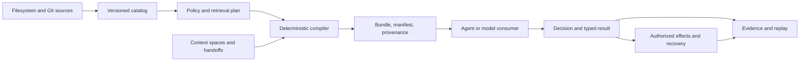

# CIGAR: Context Intelligence Graph Agentic Runtime

[](https://pypi.org/project/hol-cigar/)
[](https://pypi.org/project/hol-cigar/)
[](#install-the-python-sdk)
[](https://github.com/hashgraph-online/hol-cigar/actions/workflows/fast-ci.yml)
[](https://github.com/hashgraph-online/hol-cigar/actions/workflows/publish-hol-cigar.yml)
[](./LICENSE)
[](https://github.com/hashgraph-online/hol-cigar/stargazers)

|  | **Give AI agents the right context—and only the authority they need.** CIGAR is an open protocol for deterministic context compilation, bounded agent handoffs, governed effects, and replayable evidence.<br><br>[Visit the CIGAR website](https://hol.org/cigar)<br>[Install the Python SDK](#install-the-python-sdk)<br>[Read the documentation](docs/README.md)<br>[PyPI Package (`hol-cigar`)](https://pypi.org/project/hol-cigar/)<br>[Report an Issue](https://github.com/hashgraph-online/hol-cigar/issues) |
| :--- | :--- |

CIGAR makes the decision environment around an AI agent explicit. It sits between source systems
and an agent or model runtime so applications can govern what context is disclosed, constrain
delegated authority, recover external actions, and reproduce the evidence behind a decision.

CIGAR is model-agnostic and developed by [HOL](https://hol.org). It is not a model, hosted agent
service, autonomous scheduler, or replacement for an application-specific orchestrator.

> [!IMPORTANT]
> This repository contains two bounded developer previews. The Python 3.14 SDK is published as
> [`hol-cigar` 0.9.1 on PyPI](https://pypi.org/project/hol-cigar/); its import package is
> `cigar_sdk`. The broader **CIGAR Honey v0.9** runtime (`0.9.0-honey.1`) remains an unpublished,
> unsupported Apple-silicon preview and is not production-qualified, signed, or notarized. See
> [current status](#current-status) before evaluating either surface.

## Install the Python SDK

```bash
python -m pip install "hol-cigar==0.9.1"
```

The SDK exposes all 45 frozen CIGAR v1 operations through synchronous and asynchronous clients.
It provides typed problems, bounded deadlines, safe retry, resumable streams, pagination, fixed
idempotency keys, and local semantic bundle and delta verification.

[Python SDK guide](sdk/python/README.md) ·
[PyPI package](https://pypi.org/project/hol-cigar/) ·
[Package qualification and limitations](packaging/pypi/README.md) ·
[Security policy](SECURITY.md)

## Start here

| If you want to... | Start with |
| :--- | :--- |
| Use the published Python SDK developer preview | Install [`hol-cigar==0.9.1`](https://pypi.org/project/hol-cigar/); import it as `cigar_sdk`. |
| Evaluate the Honey runtime developer preview | [Install Honey](docs/guides/honey-install.md), then run the [offline context quickstart](docs/guides/honey-quickstart.md). |
| Understand the security model first | Read [Honey security and limitations](docs/guides/honey-security-limitations.md). |
| Try agent coordination | Follow the [two-agent workflow](docs/guides/honey-two-agent.md). |
| Try MCP or Claude Code | Follow the [MCP and Claude Code guide](docs/guides/honey-mcp-claude.md). |
| Build or contribute from source | Install the versions in [`support.toml`](support.toml), then run `cargo xtask bootstrap`. |

For source development, `bootstrap` validates required tools and generated artifacts. It does not
install software or fetch missing dependencies. Tests are expected to remain hermetic and offline.

```bash
cargo xtask bootstrap
cargo xtask test unit
```

## Why CIGAR?

Agent systems routinely assemble context, call tools, hand work to other agents, and retry after
partial failures. Without an explicit runtime contract, those operations are difficult to govern or
reproduce: source text can blur into instruction authority, prompt construction becomes invisible,
tool outcomes are mistaken for certainty, and audit logs omit the context that shaped a decision.

CIGAR makes that decision environment explicit. It sits between source systems and an agent or
model runtime and provides:

- deterministic, provenance-bearing context bundles instead of opaque prompt concatenation;
- policy enforcement before protected content is disclosed;
- recipient-bound handoffs with attenuated authority and typed result merging;
- durable effect intent, authorization, dispatch, reconciliation, and compensation;
- evidence reproduction and no-egress observational replay; and
- content-safe operational signals without storing hidden model reasoning.

## What can you evaluate?

| Workflow | What CIGAR demonstrates |
| :--- | :--- |
| **Governed context compilation** | Observe filesystem or Git sources, apply policy and budgets, and produce a stable bundle with a manifest and provenance. |
| **Two-agent collaboration** | Fork private work, issue a signed and attenuated handoff, accept it once, and merge a typed result against an exact base. |
| **Recoverable external actions** | Record intent before dispatch, preserve `UNKNOWN` after ambiguous execution, then reconcile or compensate explicitly. |
| **Replay and audit** | Reconstruct declared inputs, verify retained evidence, or replay recorded observations without contacting a live provider. |
| **Local agent integration** | Use the CLI, embedded runtime, local daemon, MCP server, Claude Code adapter, or language SDKs. |

## How it works



1. **Observe sources.** Filesystem and Git connectors discover content under explicit source
   identities, exclusions, lifecycle rules, and integrity metadata.
2. **Plan under policy.** A context contract fixes purpose, principal, projects, consistency,
   trust constraints, token lanes, compiler profile, and catalog watermark.
3. **Compile deterministically.** CIGAR sorts, deduplicates, filters, budgets, materializes, and
   hashes selected context into an immutable bundle and manifest.
4. **Coordinate bounded work.** Context spaces preserve immutable bases, private overlays,
   checkpoints, signed handoffs, typed changes, and explicit conflicts.
5. **Handle actions as effects.** External mutation is separated into intent, authorization,
   dispatch, observation, reconciliation, and compensation. Ambiguous execution remains `UNKNOWN`.
6. **Retain observable evidence.** Decisions bind inputs, policy, context, runtime fingerprints,
   outputs, effects, observations, and uncertainty without requesting hidden chain-of-thought.

The public protocol currently defines seven services covering catalog, context, spaces, handoffs,
effects, replay, and operations. See the [public API reference](docs/reference/public-api.md) for the
operation-level contract.

## Honey v0.9 developer preview

Honey is the first bounded CIGAR profile intended for hands-on local evaluation.

### Selected scope

- Apple-silicon macOS (`aarch64-apple-darwin`);
- embedded and local-sidecar deployment modes;
- one local operating-system user with explicit CIGAR agent principals;
- filesystem and Git ingestion;
- a local filesystem reference effect;
- CLI, local daemon, MCP, and Claude Code workflows;
- direct Python and TypeScript packages plus an offline Rust local-registry kit; and
- deterministic workflows that need neither a model provider nor network access.

### Explicitly deferred

- Linux, Windows, and Intel macOS release support;
- remote multi-tenancy and shared PostgreSQL/S3 deployment;
- containers, Kubernetes, Homebrew, public npm and crates.io publication, and PyPI publication
  outside the separately bounded `hol-cigar` SDK profile;
- HTTPS effects, arbitrary extensions, live-provider replay, and remote OTLP;
- vector retrieval in the selected release profile;
- general benchmark or efficacy claims; and
- production support, Apple signing/notarization, long-duration qualification, and GA guarantees.

The repository contains implementation and design work beyond Honey. Code presence does not imply
that a surface is selected, packaged, qualified, published, or supported by this release profile.

## Current status

The checked-in product authority currently declares:

| Property | Value |
| :--- | :--- |
| Marketing name | CIGAR Honey v0.9 |
| Version | `0.9.0-honey.1` |
| Context ABI | `cigar.context.v1` |
| Release state | `developer-preview` |
| Target | `aarch64-apple-darwin` |
| Honey runtime publication | Not published |
| Python SDK publication | [`hol-cigar` 0.9.1 on PyPI](https://pypi.org/project/hol-cigar/) |
| Support | Unsupported evaluation software |
| Production qualification | False |
| Signing and notarization | Not included |

The Honey artifact profile defines a closed 13-file candidate inventory with checksum and structural
verification. Final qualification evidence is not complete, so artifact integrity must not be
reported as production qualification.

Machine-readable authorities take precedence over prose:

- [`packaging/product-version.v1.json`](packaging/product-version.v1.json) — version and publication state;
- [`packaging/honey/capability-profile.v1.json`](packaging/honey/capability-profile.v1.json) — selected capabilities and platform;
- [`packaging/honey/artifact-matrix.v1.json`](packaging/honey/artifact-matrix.v1.json) — exact artifact inventory; and
- [`packaging/honey/release-requirements.v1.json`](packaging/honey/release-requirements.v1.json) — mandatory gates and prohibited claims.
- [`packaging/pypi/release-profile.v1.json`](packaging/pypi/release-profile.v1.json) — the separate
  `hol-cigar` 0.9.1 PyPI developer-preview identity and bounded qualification gates.

Progress toward the broader CIGAR v1 design is tracked in
[`IMPLEMENTATION_STATUS.md`](IMPLEMENTATION_STATUS.md) against [`prd.md`](prd.md). Those planning
documents do not expand Honey's release claims.

## Repository map

| Path | Contents |
| :--- | :--- |
| `crates/` | Rust protocol, catalog, compiler, policy, space, effects, replay, storage, API, daemon, CLI, MCP, and support crates. |
| `sdk/` | Python, TypeScript, Rust, and Go SDK source and contract tests. Go is not selected for Honey packaging. |
| `adapters/`, `connectors/` | Claude Code and source-system integrations. |
| `spec/`, `schemas/`, `proto/` | Versioned operations, payloads, schemas, and transport contracts. |
| `conformance/` | Conformance runners, vectors, and install qualification tools. |
| `demos/` | Deterministic Honey context, handoff, effect, replay, and injection-defense scenarios. |
| `packaging/`, `scripts/release/` | Product authority, artifact producers, verifiers, and qualification workflows. |
| `docs/` | Guides, API reference, operations, troubleshooting, release verification, and design documentation. |
| `artifacts/`, `reports/` | Implementation and test records; not automatically evidence for a later source revision. |

## Documentation

- [Documentation index](docs/README.md)
- [Python SDK package on PyPI](https://pypi.org/project/hol-cigar/)
- [Python SDK guide](sdk/python/README.md)
- [Core concepts](docs/guides/concepts.md)
- [Honey installation](docs/guides/honey-install.md)
- [Honey offline quickstart](docs/guides/honey-quickstart.md)
- [Handoffs, effects, and replay](docs/guides/handoffs-effects-replay.md)
- [SDK guides](docs/guides/sdks.md)
- [Operations](docs/operations/index.md)
- [Troubleshooting](docs/troubleshooting/index.md)
- [Release verification](docs/release/verification.md)
- [Artifact-oriented Honey README](README_HONEY.md)

## Security

Honey's authority, integrity, and traceability controls operate inside a single local-user trust
boundary. They are not process isolation between mutually hostile programs running as that user.
Review [Honey security and limitations](docs/guides/honey-security-limitations.md) before using CIGAR
with sensitive material.

Report vulnerabilities through the private process in [`SECURITY.md`](SECURITY.md). Do not publish
private source, prompts, credentials, handoff capsules, transcripts, or diagnostic archives.

## Resources

- [HOL](https://hol.org)
- [HOL GitHub organization](https://github.com/hashgraph-online)
- [`hol-cigar` on PyPI](https://pypi.org/project/hol-cigar/)
- [CIGAR documentation](docs/README.md)
- [GitHub Issues](https://github.com/hashgraph-online/hol-cigar/issues)

## License

CIGAR is licensed under the terms in [`LICENSE`](LICENSE).
