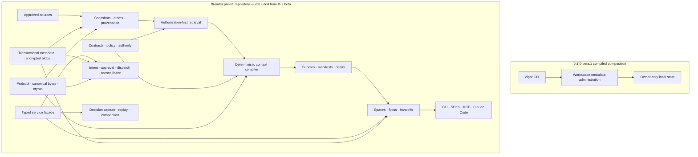

# CIGAR — initial beta

**Composable Intelligence Graph Agent Runtime**

CIGAR is a governed context runtime for agent workflows. The broader system turns approved source
snapshots into policy-constrained, provenance-bearing context; carries that context across focused
work and attenuated handoffs; records external effects before dispatch; and preserves the evidence
needed to explain or replay a decision.

The first beta is intentionally much smaller. `0.1.0-beta.1` is a transport-free, local
workspace-metadata administrator: it records source and project directory bindings, directed
project links, and the active project or focus in private local state. It does **not** read source
contents, compile agent context, run a daemon, expose an API, execute effects, or connect to a
model provider.

> [!IMPORTANT]
> `0.1.0-beta.1` is a prerelease and declares `production_ready=false`. The repository currently
> records the release as `source_candidate_ready / STOP-SHIP` while native build, installed-byte,
> signing, legal, and publication gates remain open. Until an authenticated release announcement
> says otherwise, treat source builds as development builds—not as published or supported release
> artifacts. See [Implementation status](IMPLEMENTATION_STATUS.md) and the
> [initial-beta release contract](docs/release/INITIAL_BETA.md).

## Contents

- [What ships in the beta](#what-ships-in-the-beta)
- [Install verified release bytes](#install-verified-release-bytes)
- [Five-minute beta walkthrough](#five-minute-beta-walkthrough)
- [Commands, configuration, and state](#commands-configuration-and-state)
- [Use the beta from an application](#use-the-beta-from-an-application)
- [How the broader CIGAR system works](#how-the-broader-cigar-system-works)
- [Repository architecture](#repository-architecture)
- [SDK and service surfaces](#sdk-and-service-surfaces-not-included-in-this-beta)
- [Claude Code adapter](#claude-code-adapter-not-included-in-this-beta)
- [Security and honest limitations](#security-and-honest-limitations)
- [Build and test from source](#build-and-test-from-source)
- [Documentation and support](#documentation-and-support)

## What ships in the beta

| Property | `0.1.0-beta.1` contract |
|---|---|
| Release profile | `cigar.beta.embedded-local.linux-x86_64.v1` |
| Capability boundary | Local workspace-metadata administration only |
| Required qualification runtime | Ubuntu 24.04, x86-64, glibc 2.39 |
| Rust target | `x86_64-unknown-linux-gnu` |
| Network surface | None; no listener, daemon, or remote client |
| Persistence | Owner-controlled local `.cigar` state |
| Distribution | Six archives requiring complete-set authentication; no installer or package-manager release |
| Release posture | Prerelease; not production-ready |

The `cigar` binary in this profile can:

- initialize private workspace metadata;
- add, list, and remove source-directory references;
- attach, list, detach, switch, link, and unlink project-directory references;
- switch and close a local focus identifier; and
- emit human-readable or versioned JSON results.

Adding a source stores its canonical path only. The beta does not discover files, scan content,
create catalog atoms, build an index, retrieve records, or compile a prompt.

### Beta today versus the broader repository

| Area | Initial beta | Broader pre-v1 implementation in this repository |
|---|---|---|
| Sources | Directory references only | Immutable snapshots, atomization, provenance, and invalidation |
| Context | Not available | Policy-first retrieval, deterministic planning, manifests, bundles, and deltas |
| Coordination | Local project links and one focus ID | Versioned context spaces, overlays, checkpoints, handoffs, and typed merges |
| External actions | Not available | Intent-first governed effects, receipts, reconciliation, and compensation |
| Evidence | Local administrative results | Decision capture and evidence, invocation, observational, and live-comparison replay |
| Interfaces | Local `cigar` process | Full CLI, daemon, HTTP/gRPC, Rust/TypeScript/Python/Go SDKs, MCP, and Claude Code |
| Deployment | One declared Linux runtime | Local/shared deployment and multi-platform qualification assets under development |

The right-hand column explains the codebase architecture. Those components are **not** artifacts or
support claims for `0.1.0-beta.1`. The machine-readable
[beta capability policy](packaging/beta/capability-policy.v1.json) is the authoritative closed
boundary.

## Install verified release bytes

There is no beta installer and no valid download URL should be inferred from this repository. Use
only the exact artifacts named by an authenticated release announcement.

The closed release set contains six archives:

1. source;
2. documentation;
3. schemas and release contracts;
4. beta conformance material;
5. licenses and notices; and
6. the Ubuntu x86-64 `cigar` binary.

Before extracting or executing anything:

1. obtain the verifier from a separately authenticated source revision or trusted tool
   distribution;
2. obtain the beta trust policy through an independent authenticated channel;
3. verify the complete release directory offline; and
4. require a passing result bound to the exact release directory, trust policy, and artifact set.

From that trusted verifier environment:

```console
python3 scripts/release/beta_release.py verify \
  --release /absolute/path/to/release-directory \
  --trust-policy /absolute/path/to/beta-trust-policy.json \
  --openssl /absolute/path/to/pinned/openssl
```

A checksum detects accidental change; it does not authenticate a download by itself. After the
complete-set verification passes, extract
`cigar-0.1.0-beta.1-x86_64-unknown-linux-gnu.tar.gz` into a **new, empty, user-owned directory**,
place that directory's `bin` subdirectory on `PATH`, and run CIGAR as an unprivileged user.

Confirm the installed surface before creating state:

```console
cigar version
cigar help
```

`cigar version` is always build-metadata JSON. `cigar help` is always text and must match the
[frozen beta help](crates/cigar-cli/assets/cigar-help-beta.txt). A build that succeeds on another
operating system or architecture is not a qualification or support claim.

For the complete trust procedure, read the
[beta user guide](docs/release/BETA_USER_GUIDE.md#filesystem-and-security-boundary).

## Five-minute beta walkthrough

This walkthrough creates a disposable metadata workspace under your home directory. It records
paths only; it does not inspect either source directory.

```console
mkdir -p "$HOME/cigar-demo/source" "$HOME/cigar-demo/secondary"
cd "$HOME/cigar-demo"

# Preview, then initialize $HOME/cigar-demo/.cigar.
cigar --dry-run init "$HOME/cigar-demo"
cigar --yes init "$HOME/cigar-demo"

# Register a source-directory reference.
cigar --dry-run source add workspace-source "$HOME/cigar-demo/source"
cigar --yes source add workspace-source "$HOME/cigar-demo/source"
cigar --output json source list

# Register two projects and a directed relationship.
cigar --yes project attach primary "$HOME/cigar-demo"
cigar --yes project attach secondary "$HOME/cigar-demo/secondary"
cigar --yes project switch primary
cigar --yes project link primary secondary

# Select a focus and inspect project state.
cigar --yes focus switch beta-review
cigar --output json project list
```

State-changing commands require `--yes` or a positive interactive confirmation. Always preview an
unfamiliar mutation with `--dry-run`. In automation, `--non-interactive` disables prompts but does
not authorize a mutation; combine it with `--yes` only after the intended change has been reviewed.

Optional cleanup:

```console
cigar --yes focus close beta-review
cigar --yes project unlink primary secondary
cigar --yes project detach secondary
cigar --yes source remove workspace-source
```

## Commands, configuration, and state

### Exact command surface

| Command | Purpose |
|---|---|
| `cigar init [project-root]` | Initialize private state at `<project-root>/.cigar`; defaults to the current directory |
| `cigar source add <source-id> <directory>` | Record an existing source directory by canonical path |
| `cigar source list` | List recorded source references |
| `cigar source remove <source-id>` | Remove a source reference |
| `cigar project list` | List attached projects, links, and active state |
| `cigar project attach <project-id> <directory>` | Attach an existing project directory |
| `cigar project detach <project-id>` | Detach a project and its links |
| `cigar project switch <project-id>` | Make an attached project active |
| `cigar project link <from-project-id> <to-project-id>` | Add a directed link between attached projects |
| `cigar project unlink <from-project-id> <to-project-id>` | Remove a directed project link |
| `cigar focus switch <focus-id>` | Set the active focus identifier |
| `cigar focus close [focus-id]` | Close the active focus, optionally asserting its ID |
| `cigar help` | Print the closed beta help contract |
| `cigar version` | Print canonical build metadata as JSON |

Identifiers are 1–256 ASCII characters using letters, digits, `.`, `-`, `_`, or `:`. Source and
project directory arguments must already exist. Project links are directed, require two attached
projects, and cannot link a project to itself.

This beta intentionally uses literal `help` and `version` commands. It rejects aliases such as
`--help`, `-h`, `--version`, and `-V`, as well as undocumented options and commands.

### Global controls

| Option | Behavior |
|---|---|
| `--output text\|json` | Select operational and configuration output; help remains text and version remains JSON |
| `--deadline Nms\|Ns\|Nm` | Bound work before publication; default 30 seconds, maximum 5 minutes |
| `--config <path>` | Load one explicit embedded-beta TOML file |
| `--target embedded` / `--embedded` | Assert the only compiled target |
| `--dry-run` | Validate and preview without publishing state |
| `--yes` | Confirm a reviewed mutation |
| `--non-interactive` | Disable prompts; does not imply confirmation |
| `--quiet` | Disable progress output |
| `--color auto\|always\|never` | Control optional color |
| `--unicode auto\|always\|never` | Control status glyphs |
| `--width 20..1000` | Bound human-readable layout width |
| `--explain-config` | Report the closed effective configuration |

Unknown commands, options, targets, and configuration keys fail closed.

### Configuration

Without `--config`, state lives in `.cigar` beneath the current working directory. The beta does
not use the full product's system, user, project, or environment configuration precedence.

An explicit beta configuration has exactly three fields:

```toml
schema_version = 1
target = "embedded"
project_state_directory = "/absolute/owner-controlled/path/.cigar"
```

Keep this file owner-controlled—mode `0600` on Unix is recommended—and pass an absolute path. The
loader rejects unknown keys, non-embedded targets, relative state paths, `.` or `..` path
components, unsafe permissions, links, unstable files, and files larger than 1 MiB.

Inspect the effective selection without changing state:

```console
cigar --config "$HOME/.config/cigar/beta.toml" \
  --output json \
  source list \
  --explain-config
```

### State and durability

The private state directory contains a strict, bounded `state.json` record with a monotonically
increasing generation. On Unix, CIGAR creates the directory with mode `0700` and the state file
with mode `0600`. Mutations use a directory lock, generation validation, a private temporary file,
file synchronization, atomic rename, and directory synchronization.

Treat the entire state layout as an implementation detail:

- do not edit `state.json` directly;
- do not loosen permissions, hard-link the file, or replace the directory with a symlink;
- do not build an application around the JSON file layout; use `cigar --output json` instead; and
- back up the whole directory only while no CIGAR process is mutating it.

This prerelease has no supported backup, restore, migration, or recovery command. If state fails
integrity validation, stop mutations and restore a trusted local copy.

Deadlines and Ctrl-C cancel only before publication begins. Once publication wins the commit
boundary, CIGAR waits for durable settlement rather than claiming cancellation for a visible
change. `CLI_STATE_COMMIT_UNCERTAIN` (exit 75) means a mutation may already be visible even though
durability could not be confirmed. Inspect current state and its generation before deciding
whether to retry.

## Use the beta from an application

The supported beta integration boundary is the installed `cigar` process with versioned JSON
output. There is no beta SDK, library ABI, socket, HTTP endpoint, gRPC service, or MCP server.

Invoke CIGAR with an argument array, never with shell-interpolated user input. Set a CIGAR deadline,
set the parent-process timeout slightly longer, close stdin for non-interactive calls, and check
both the process exit status and the JSON envelope.

```python
import json
import subprocess


completed = subprocess.run(
    [
        "cigar",
        "--config", "/absolute/path/to/beta.toml",
        "--output", "json",
        "--deadline", "20s",
        "--non-interactive",
        "source", "list",
    ],
    stdin=subprocess.DEVNULL,
    capture_output=True,
    text=True,
    timeout=25,
    check=False,
)

if completed.returncode != 0:
    # Invocation failures can occur before JSON output is selected.
    raise RuntimeError(f"CIGAR exited with status {completed.returncode}")

document = json.loads(completed.stdout)
if document.get("schema_version") != "cigar.cli.output.v1":
    raise RuntimeError("Unexpected CIGAR output schema")
if document.get("ok") is not True:
    raise RuntimeError("CIGAR reported an unsuccessful operation")

sources = document["result"]
```

Successful operational envelopes contain `command`, `operation_id`, `target`, `dry_run`, `result`,
and bounded metadata. Post-parse operational failures use the same schema with `ok: false` and a
content-safe `error` containing `code`, `message`, and `remediation`. Syntax errors can occur before
JSON selection; a nonzero process exit status remains authoritative.

For application-driven mutations:

1. issue the exact argv with `--non-interactive --dry-run`;
2. validate the result and intended absolute paths;
3. repeat the same logical argv with `--non-interactive --yes`; and
4. never automatically retry `CLI_STATE_COMMIT_UNCERTAIN`.

Filesystem paths are metadata and may still be sensitive. Avoid copying stdout or stderr into
public logs without applying the application's own disclosure policy.

## How the broader CIGAR system works

The rest of the repository implements the larger pre-v1 architecture. This diagram is an
architectural map, **not** the initial-beta feature list.



The major concepts are:

| Concept | Meaning |
|---|---|
| **Atom** | The smallest provenance-bearing indexed unit derived from a source snapshot |
| **Context contract** | Task, budget, classification ceiling, freshness, source policy, and allowed operation classes |
| **Selection manifest** | The inspectable record of candidates considered, selected, transformed, or rejected |
| **Bundle** | Canonical context blocks compiled for a consumer under one exact contract and dependency set |
| **Delta** | An exact-base change that must reproduce a declared target bundle |
| **Context space** | A versioned branch for focused work, overlays, commits, leases, and checkpoints |
| **Handoff** | A signed, recipient-bound, attenuated capsule containing selected references and authority—not a parent transcript |
| **Effect** | A governed external mutation with durable intent, authorization, attempt, receipt, and reconciliation state |
| **Replay** | Reconstruction from recorded dependencies and observations; non-live replay forbids network and mutation |

CIGAR makes context selection and recorded decisions inspectable. It does not make model output
deterministic, and it does not promise universal exactly-once behavior from external systems. See
[Core concepts](docs/guides/concepts.md) for the portable definitions.

## Repository architecture

The Rust workspace follows a layered dependency direction: foundational protocol, canonicalization,
and cryptography do not depend upward on application transports or product surfaces.

| Layer | Main paths | Responsibility |
|---|---|---|
| Foundations | [`cigar-protocol`](crates/cigar-protocol/), [`cigar-canon`](crates/cigar-canon/), [`cigar-crypto`](crates/cigar-crypto/) | Portable records and validation, deterministic CBOR/digests, encryption, keys, and signatures |
| Storage and knowledge | [`cigar-store`](crates/cigar-store/), [`cigar-catalog`](crates/cigar-catalog/), [`cigar-code-intel`](crates/cigar-code-intel/) | Transactional state, encrypted blobs, immutable snapshots, atoms, provenance, invalidation, and structural parsing |
| Governance and compilation | [`cigar-policy`](crates/cigar-policy/), [`cigar-retrieval`](crates/cigar-retrieval/), [`cigar-compiler`](crates/cigar-compiler/) | Policy evaluation, authorized candidates, deterministic planning, packing, manifests, caches, and deltas |
| Coordination | [`cigar-space`](crates/cigar-space/) | Context history, overlays, focus branches, checkpoints, signed handoffs, and typed child-result merge |
| Actions and evidence | [`cigar-effects`](crates/cigar-effects/), [`cigar-replay`](crates/cigar-replay/) | Intent-first effects, fenced dispatch, receipts, reconciliation, decision capture, and replay |
| Application services | [`cigar-api`](crates/cigar-api/), [`cigar-observe`](crates/cigar-observe/), [`cigar-extension-host`](crates/cigar-extension-host/) | Typed orchestration, content-safe telemetry, and capability-limited extension execution |
| Product surfaces | [`cigar-daemon`](crates/cigar-daemon/), [`cigar-cli`](crates/cigar-cli/), [`cigar-mcp`](crates/cigar-mcp/), [`cigar-claude-hook`](crates/cigar-claude-hook/) | Runtime composition, terminal UX, bounded MCP stdio, and public Claude hooks |
| SDKs | [`sdk/rust`](sdk/rust/), [`sdk/typescript`](sdk/typescript/), [`sdk/python`](sdk/python/), [`sdk/go`](sdk/go/) | Embedded and remote typed clients sharing Context ABI `cigar.context.v1` |
| Verification | [`conformance`](conformance/), [`tests`](tests/), [`fuzz`](fuzz/), [`benches`](benches/), [`demos`](demos/) | Cross-runtime vectors, integration/security/chaos tests, fuzzing, benchmarks, and recorded workflows |
| Delivery | [`schemas`](schemas/), [`spec`](spec/), [`migrations`](migrations/), [`packaging`](packaging/), [`deploy`](deploy/), [`docs`](docs/) | Public contracts, persistence history, artifact policy, deployment assets, operations, and release verification |

The optional [`cigar-dashboard`](crates/cigar-dashboard/) sidecar and browser shell are still being
integrated, while `cigar-soak` is internal qualification tooling. Neither is initial-beta
functionality.

## SDK and service surfaces not included in this beta

> [!CAUTION]
> The following interfaces exist in the development repository but are not built, packaged,
> installed, or supported by `0.1.0-beta.1`. Do not install source-tree SDK artifacts and describe
> them as beta packages.

The broader interface is a frozen 45-operation contract with 70 nominal payload types. The SDKs
share Context ABI `cigar.context.v1`, preserve caller idempotency keys for eligible retries, expose
typed problems, and never automatically retry `dispatchEffect`.

| Surface | Development implementation | Start here |
|---|---|---|
| Full CLI | Embedded composition, protected local IPC, or HTTPS remote target | [CLI architecture](crates/cigar-cli/README.md) |
| Service | Typed facade with HTTP/OpenAPI and gRPC/Protobuf mappings | [Public API reference](docs/reference/public-api.md) |
| Rust | Async embedded runtime or bounded HTTP/SSE client | [Rust SDK](sdk/rust/README.md) |
| TypeScript | ESM HTTP/SSE client with local bundle verification | [TypeScript SDK](sdk/typescript/README.md) |
| Python | Async and synchronous HTTP/SSE clients | [Python SDK](sdk/python/README.md) |
| Go | HTTP/SSE and high-level gRPC clients | [Go SDK](sdk/go/README.md) |
| MCP | Bounded MCP 2025-06-18 stdio facade with ten tools | [MCP facade](crates/cigar-mcp/README.md) |

The canonical development contracts live in
[`schemas/openapi`](schemas/openapi/), [`schemas/proto`](schemas/proto/),
[`schemas/json`](schemas/json/), and
[`sdk/capabilities-v1.json`](sdk/capabilities-v1.json). Package installation and service deployment
must wait for a separately qualified release profile that includes those artifacts.

## Claude Code adapter not included in this beta

The repository contains a reference Claude Code adapter built only on documented plugin,
command-hook, and MCP surfaces. It is a separately qualified full-product surface; the initial beta
does not include the plugin command, daemon, `cigar-mcp`, or `cigar-claude-hook` binaries needed to
run it.

The adapter's design includes:

- a user-scoped plugin that runs already-installed, signed CIGAR executables and downloads no
  executable code after installation;
- ten bounded MCP tools for context, catalog, checkpoints, handoffs, and mediated effects;
- eight stable `cigar://` resource families;
- documented command hooks for session, prompt, instruction, tool, subagent, task, compaction,
  worktree-removal, stop, failure, and end events;
- bounded deterministic context injection, duplicate suppression, and `/cigar:why` provenance and
  token-accounting inspection;
- structured compaction checkpoints and recipient-specific, one-use, read-context-only subagent
  handoffs; and
- visible fail-open degradation for context lookup, with fail-closed authorization for recognized
  mediated-effect dispatch.

The hook validates provider `transcript_path` as inert input but never opens, parses, copies,
modifies, or depends on provider transcripts, session caches, or undocumented configuration files.

The current separate compatibility declaration is exactly Claude Code `2.1.207` on Apple-silicon
macOS. That does not overlap the Linux x86-64 initial-beta profile and is not a claim that the
adapter can be combined with this beta.

CIGAR cannot govern effects hidden inside arbitrary shell commands, remove provider output already
present in context, make Claude output deterministic, or replace Claude Code's filesystem and tool
permission system. Read the [Claude Code adapter README](adapters/claude-code/README.md),
[compatibility record](adapters/claude-code/compatibility.json), and
[recorded demo](demos/claude-code/) for the development implementation.

No separate OpenAI, Codex, Gemini, Cursor, Copilot, or other provider adapter is currently checked
in or qualified. The typed API and MCP facade are the provider-neutral foundations for future
adapters; their presence is not a support claim.

## Security and honest limitations

### Initial-beta security boundary

- Run as an unprivileged user and keep the workspace, configuration, and state directory
  owner-controlled.
- The beta has no network listener or remote client and does not read registered source contents.
- Configuration and state access reject unsafe links and permissions; unknown configuration and
  CLI surfaces fail closed.
- Use `--dry-run` before mutation and `--yes` only after review.
- Do not use this prerelease to protect production secrets or authorize external effects.
- Treat recorded filesystem paths as potentially sensitive metadata.
- Authenticate the complete release set before extraction; a digest without a trusted signature
  is not sufficient.
- Do not blindly retry a timed-out, interrupted, or uncertain mutation.

### What CIGAR is—and is not

CIGAR is a context governance and evidence runtime. It is not a model gateway, agent planner,
workflow scheduler, vector database, graph-database product, hosted agent studio, or prompt
marketplace. It complements rather than replaces model-provider controls, operating-system
sandboxing, application authorization, and human review.

Report vulnerabilities only through the private channel named in an authenticated release
announcement. Verify the channel independently, never put exploit details or credentials in a
public issue, and follow the repository [security policy](SECURITY.md).

## Build and test from source

Source builds are for contributors and evaluation. They are not substitutes for the authenticated
six-archive release, native platform qualification, installed-byte tests, or release signatures.

### Build the narrow beta composition

Rust is pinned to `1.92.0`. For the required native target, the release-profile command is:

```console
cargo build --locked --release \
  -p cigar-cli \
  --no-default-features \
  --features beta-embedded \
  --target x86_64-unknown-linux-gnu
```

The `full` and `beta-embedded` feature compositions are mutually exclusive; selecting both or
neither fails compilation.

Run the closed beta checks:

```console
python3 scripts/release/beta_profile.py check --root .

cargo test --locked \
  -p cigar-cli \
  --no-default-features \
  --features beta-embedded \
  --lib \
  --test beta_surface
```

### Work on the broader repository

Exact development tool versions are declared in [`support.toml`](support.toml). Bootstrap validates
the environment but deliberately installs nothing.

```console
cargo xtask bootstrap
cargo xtask generate --check
cargo xtask fmt --check
cargo xtask lint
cargo xtask test unit
```

The codebase forbids unsafe Rust and denies warnings, undocumented public items, panics in library
code via common shortcuts, and unchecked `unwrap`, `expect`, `todo`, and `unimplemented` patterns
through workspace lint policy. Tests and release commands are designed to remain hermetic and
offline unless a separately authorized qualification lane says otherwise.

## Documentation and support

### Initial beta

- [Beta user guide](docs/release/BETA_USER_GUIDE.md) — supported use, safety, and verification
- [Exact beta help](crates/cigar-cli/assets/cigar-help-beta.txt) — compiled command and option surface
- [Initial-beta release contract](docs/release/INITIAL_BETA.md) — scope, gates, and open blockers
- [Capability policy](packaging/beta/capability-policy.v1.json) — machine-readable included/excluded boundary
- [Beta packaging profile](packaging/beta/README.md) — artifact and evidence model
- [Implementation status](IMPLEMENTATION_STATUS.md) — current work-packet and release state

### Broader pre-v1 development

- [Documentation home](docs/README.md)
- [Concepts](docs/guides/concepts.md)
- [Project and focus workflows](docs/guides/workflows.md)
- [Public API](docs/reference/public-api.md)
- [SDK guide](docs/guides/sdks.md)
- [Claude Code integration](docs/guides/claude-code.md)
- [Operations and runbooks](docs/operations/index.md)
- [Conformance kit](conformance/README.md)

The general five-minute quickstart and deployment guides describe the broader product and are not
valid instructions for the initial beta.

CIGAR is licensed under the [Apache License 2.0](LICENSE). Third-party notices and exact beta
license inventories are carried in the release's authenticated license archive.
