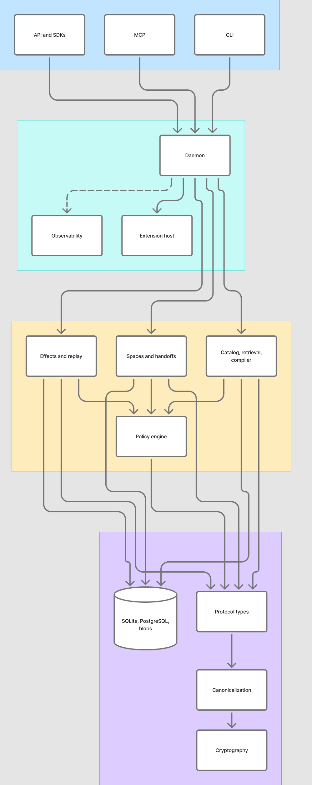
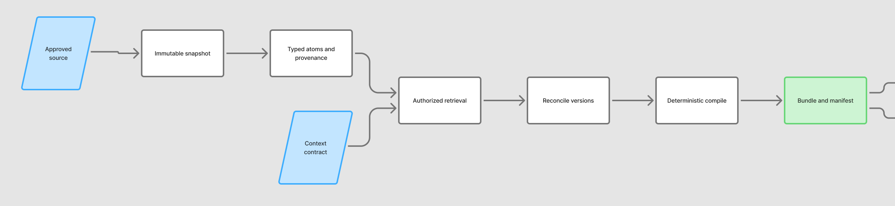
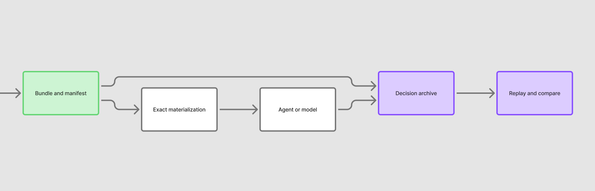
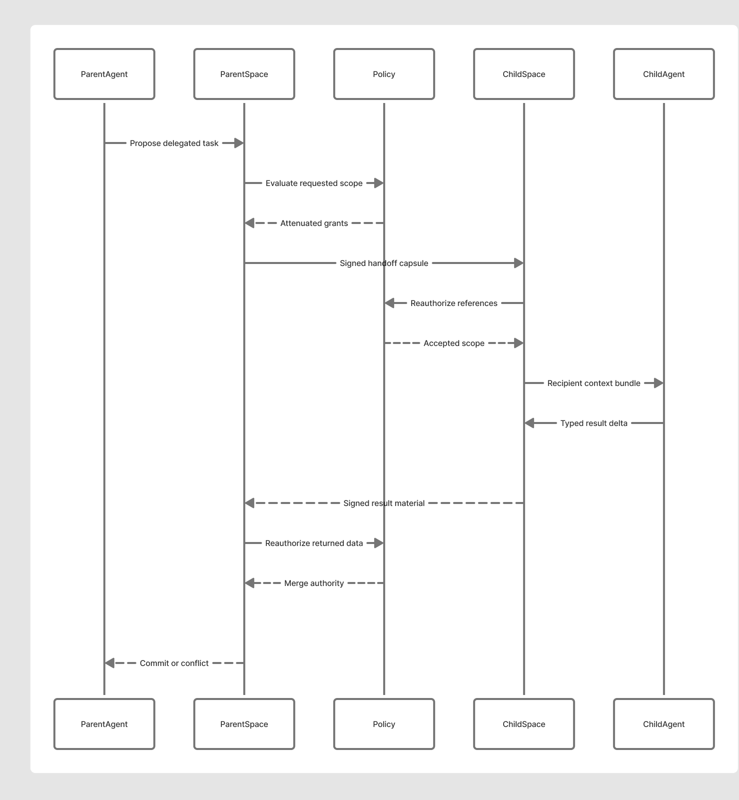

# CIGAR: Building a Governed Context and Evidence Runtime for AI Agents

*Inside a Rust codebase that treats context selection, agent handoffs, external actions, and replay as protocol operations rather than prompt conventions.*

AI agents are usually introduced through their most visible behavior: a model receives a prompt, calls a tool, and produces an answer. The difficult engineering begins one layer below that interface.

Which sources was the agent allowed to see? Which versions did it actually receive? Why was one fact selected while another was excluded? Did another agent inherit the same authority? Was an external action recorded before it was attempted? Can an operator later reconstruct the observable conditions surrounding the result?

CIGAR—short for **Composable Intelligence Graph Agent Runtime**—is an open-source attempt to make those questions part of the system contract.

It is not a new model, an agent planner, or a visual workflow builder. It is a context and effect kernel: a set of protocols and reference implementations for organizing approved knowledge, compiling it into bounded context, coordinating work across agents, mediating external actions, and preserving evidence for observability and replay.

The project is ambitious, but its first beta is intentionally narrow. Understanding both sides—the larger architecture and the small initial release—is the best way to understand the codebase.

## The problem CIGAR is trying to solve

Most agent systems begin with a transcript. Files, tool output, instructions, memory, summaries, and user messages accumulate until the runtime has to decide what stays in the model's context window.

That arrangement creates several recurring problems:

- Context can be stale, contradictory, or detached from its source version.
- Authorization is often checked when data is fetched, but not when it is transformed, cached, handed to another agent, or replayed.
- Prompt text can blur the boundary between evidence, instructions, policy, and untrusted content.
- Multi-agent systems may exchange prose without a typed record of what was delegated or what evidence supports a returned claim.
- Tool calls can escape before durable intent, approval, and idempotency information are recorded.
- Logs can show that “an agent ran” without showing the exact observable context and policy environment in which it ran.

CIGAR's answer is to treat context as a compiled, content-addressed artifact rather than an ever-growing string.

A source becomes an immutable snapshot. A snapshot produces typed atoms and provenance edges. A context request becomes a normalized contract. Retrieval operates only over authorized partitions. A deterministic compiler selects representations under an exact budget and emits both a bundle and a manifest explaining the selection. Agent work occurs against an immutable context-space commit plus a private overlay. External actions begin as durable effect intents. Decision records bind observable inputs, outputs, evidence, and receipts without attempting to capture private chain-of-thought.

The result is less like a prompt manager and more like a small operating substrate for governed agent context.

## The design goals

The codebase is organized around a few strong goals.

**One semantic protocol across runtimes.** Embedded use, a local daemon, and a shared service should agree on canonical bytes, record identities, hashes, policy order, state transitions, and error codes.

**Determinism before model behavior.** Source normalization, policy evaluation, retrieval planning, context packing, token accounting, and manifest generation should be reproducible even though model output is not.

**Authorization at every boundary.** Visibility does not imply permission to use a tool, execute an effect, or delegate a capability. Importing a valid signed artifact does not bypass the receiving system's current policy.

**Observable evidence, not hidden reasoning.** CIGAR records task inputs, selected context, component fingerprints, tool and provider observations, outputs, uncertainty, verification, and external effects. It deliberately does not request or store hidden chain-of-thought.

**Safe external effects.** An intent, its authorization, and its idempotency identity must exist durably before dispatch. Ambiguous remote outcomes become `UNKNOWN` and require reconciliation instead of optimistic retry.

**Offline-first local operation with a shared-service path.** The architectural target includes a complete local workflow backed by SQLite and encrypted blobs, plus a PostgreSQL-compatible shared profile behind the same semantic contracts.

## How the codebase is arranged

The Rust workspace separates portable protocol behavior from application services and product surfaces.

*Figure 1. CIGAR's product surfaces compose application services, which depend on a smaller trusted foundation. The figure describes the broader development codebase, not the initial beta artifact.*

At the foundation are:

- `cigar-protocol`, which defines versioned records, validation, limits, compatibility rules, and stable errors;
- `cigar-canon`, which implements deterministic JSON and CBOR behavior plus domain-separated digests;
- `cigar-crypto`, which provides signing, encryption, key abstractions, and secret-safe types; and
- `cigar-store`, which defines transactional domain repositories and local/shared persistence implementations.

The context path is implemented through:

- `cigar-catalog` and `cigar-code-intel` for snapshots, atomization, provenance, invalidation, and structural code extraction;
- `cigar-retrieval` for exact, lexical, temporal, graph, and optional vector candidate generation;
- `cigar-policy` for hard authorization gates and deterministic policy decisions; and
- `cigar-compiler` for normalization, reconciliation, planning, packing, manifests, materialization, caching, and deltas.

Coordination and execution evidence are handled by:

- `cigar-space` for immutable context commits, private overlays, checkpoints, leases, handoffs, and typed merges;
- `cigar-effects` for intent-first external actions, approvals, attempts, receipts, reconciliation, and compensation;
- `cigar-replay` for decision capture and four forms of replay; and
- `cigar-observe` for content-safe telemetry, metrics, health, and diagnostics.

Finally, `cigar-api`, `cigar-daemon`, `cigar-cli`, and `cigar-mcp` compose those services into embedded, local, remote, and MCP-facing product surfaces. SDK work exists for Rust, TypeScript, Python, and Go, alongside a Claude Code reference adapter and an optional read-only dashboard.

This dependency direction is deliberate. Foundation crates are not supposed to depend on the daemon, network transports, provider adapters, or command-line interface. The binaries compose concrete backends; the semantic core remains portable and testable.

## From source material to agent context

CIGAR's main execution path is a series of explicit transformations.

*Figure 2. The governed path from immutable source material to a model-facing context and a replayable decision record.*

### 1. Ingest immutable source state

Filesystem or Git connectors identify an exact source root and revision. Parsers and atomizers convert that snapshot into typed records such as symbols, claims, instructions, decisions, task state, and evidence. Each record retains provenance and lifecycle information.

Secret and sensitive-content checks occur before material becomes generally eligible for retrieval. Publication is atomic: readers should see either the previous complete snapshot or the new complete snapshot, never a half-ingested mixture.

### 2. Express a context contract

A caller does not simply ask CIGAR to “find relevant text.” It provides a typed contract describing purpose, required and optional context, projects, time and trust constraints, target consumer, budget, and processing rules.

Policy evaluation occurs before candidate generation and again at downstream boundaries. Denied material should not become visible through counts, previews, cache behavior, or explanation output.

### 3. Retrieve, reconcile, and compile

Retrievers produce candidates from approved partitions. The compiler reconciles versions and conflicts using explicit source authority, validity time, observation time, verification, and supersession rules.

It then selects representations under an exact token budget. Mandatory dependencies enter first. Lane and category requirements are satisfied before optional material competes on marginal utility. Contradictory evidence remains a typed conflict instead of being silently summarized into one statement.

The output is a deterministic `ContextBundle` plus a `SelectionManifest`. The bundle contains what the consumer receives. The manifest records what was considered, why records were selected or excluded, which transformations were used, and what would invalidate the result.

When a consumer already holds an earlier bundle, CIGAR can generate a strict `ContextDelta`. Applying that delta to the declared base must reproduce the target bundle exactly; there is no fuzzy patching.

### 4. Materialize for a consumer

Materializers render the semantic bundle into an approved target representation. They cannot silently drop a semantic block, combine conflicting authority lanes, or truncate output to make it fit. Exact tokenizer and materializer fingerprints become part of the evidence.

The model or agent runtime remains replaceable. CIGAR's job is to define and preserve the observable decision environment around that consumer.

### 5. Capture and replay

A decision archive binds the task, plan, manifest, bundle, materialization, policy and index evidence, component fingerprints, observations, output references, verification receipts, and effects.

Replay can then operate at four levels:

1. **Evidence reproduction** verifies retained inputs and digests.
2. **Invocation reproduction** reconstructs the exact declared consumer input without invoking the provider.
3. **Observational replay** substitutes recorded provider and tool observations while egress is denied.
4. **Live comparison** performs a separately authorized rerun, with effects simulated unless new intents are explicitly approved.

This distinction matters. A changed model response is provider variance; a changed context bundle under identical inputs may indicate compiler or dependency drift. CIGAR keeps those categories separate.

## Multi-agent coordination without transcript forwarding

CIGAR models an agent's working state as an immutable base commit plus a private overlay. Agents propose typed changes; they do not directly rewrite canonical history.

Publication uses an expected head and a deterministic three-way merge:

- identical values deduplicate;
- changes to independent semantic keys merge;
- conflicting values retain base, current, proposed, and supporting evidence; and
- instructions, decisions, capabilities, leases, and effect state require exact-base or typed resolution rather than last-writer-wins.

Delegation follows the same philosophy. A handoff is a signed, scoped capsule—not a raw transcript.

*Figure 3. A child receives only reauthorized context and attenuated capabilities. Its result returns as typed merge material rather than an authoritative mutation.*

The issuer describes the recipient, task, criteria, projects, requested capabilities, context references, budget, topics, expiry, and audience. CIGAR intersects those requests with the issuer's actual authority and handoff policy before signing anything.

Acceptance starts authorization over again. The recipient verifies the capsule, signature, nonce, audience, expiry, and revocation state, then reauthorizes every referenced source and capability under current policy. A recipient-specific context bundle is compiled only from the accepted subset.

The child returns a `HandoffDelta` containing typed claims, evidence, decisions and alternatives, artifacts, source changes, uncertainty, blockers, verification receipts, and effect references. The parent reauthorizes that material and proposes it into a private overlay for normal three-way publication.

That mechanism can support one child agent or a larger swarm. The important point is that delegation attenuates authority and results remain proposals until the receiving context space accepts them.

## Effects are part of the evidence trail

Reading context and changing the outside world are different operations. CIGAR keeps them separate.

An external action begins in `PREPARED`, where its normalized arguments digest, protected arguments, target, preconditions, result schema, risk, originating decision and bundle, capability, idempotency scope, retry policy, expiry, and optional compensation are recorded.

Only a valid transition can move the effect through approval and authorization into dispatch. The journal entry and request digest are committed before a connector is called. A timeout or dropped response after a possible send does not become an automatic retry; it becomes `UNKNOWN` until the system can reconcile remote identity, idempotency state, target postconditions, or audit evidence.

Every effect transition is append-only and hash-chained. That provides a much stronger operational trace than a log line saying a tool was called.

## What observability means in CIGAR

CIGAR's observability model is designed to answer four practical questions:

- **What context was eligible and selected?** The contract, policy decisions, manifest, bundle, and exact source identities provide the answer.
- **What did the consumer actually receive?** Materialization bytes, tokenizer and materializer fingerprints, and invocation metadata bind the delivered representation.
- **What happened outside the model?** Tool observations, effect intents, attempts, receipts, unknown states, and reconciliation reports describe external interaction.
- **Can the observable decision environment be reconstructed?** Replay completeness reports missing or changed dependencies instead of quietly substituting current state.

Operational telemetry uses structured tracing and OpenTelemetry export, with a content-free default. IDs, digests, bounded counts, durations, state transitions, policy outcomes, queue age, and correlation identifiers belong in telemetry; prompts, source text, secrets, and unrestricted transcripts do not.

The current protocol uses SHA-256 content digests, immutable context-commit histories, signed handoffs, and hash-chained effect events. It does **not** yet define a universal Merkle state tree or Poseidon-based proof profile. Those could become future state-proof extensions, but they should not be confused with the integrity mechanisms already implemented.

## What is actually present in the first version

This is where the release boundary matters.

As of this draft on **July 14, 2026**, the repository distinguishes two things:

1. a frozen initial beta lane identified as `0.1.0-beta.1`; and
2. a much broader `1.0.0-dev.1` development implementation that is still being integrated and qualified.

### The initial beta is deliberately small

The `0.1.0-beta.1` profile is a transport-free local workspace-metadata administrator. Its compiled capability is limited to twelve workspace operations, plus `help` and `version`:

- initialize owner-controlled `.cigar` state;
- add, list, and remove source-directory references;
- attach, list, detach, switch, link, and unlink project-directory references; and
- switch or close a focus identifier.

Adding a source records its canonical path. It does not read or ingest source contents.

The beta does not compile context, run the daemon, expose HTTP, gRPC, MCP, or SDK surfaces, execute effects, connect to a model provider, perform vector retrieval, export OpenTelemetry, or support remote/shared operation. Unknown commands, flags, targets, and configuration fields fail closed.

The release profile targets Ubuntu 24.04 on x86-64 with glibc 2.39. It has no installer and is not a published production release. The repository currently marks it `source_candidate_ready / STOP-SHIP` while native artifact production, installed-byte testing, security and legal approval, signing, offline verification, publication, and readback gates remain open.

That narrowness is intentional. The beta validates the earliest local state and release-discipline boundary without implying that the entire architecture is already supported.

### The broader repository is much further along than the beta surface

Source implementations exist across protocol records, canonicalization, cryptography, policy, storage, ingestion, retrieval, deterministic compilation, context spaces, handoffs, effects, replay, extension isolation, daemon composition, APIs, CLI, MCP, SDKs, packaging, conformance, and deployment assets.

The development registry currently describes 45 operations and 70 nominal payload types. The implementation status ledger reports the core construction packets through the local/shared surfaces as complete, while quality hardening, benchmark and demo qualification, installed-artifact verification, multi-platform release evidence, and final publication gates remain active.

The active worktree is also integrating post-beta functionality across the daemon, CLI, dashboard, retrieval and vector paths, SDK packaging, configuration and compatibility contracts, migrations, release tooling, and qualification evidence. That work should be read as development source—not as proof that an artifact is packaged, qualified, published, or supported.

CIGAR's machine-readable capability ledger makes that distinction explicit with separate states for `specified`, `implemented_source`, `integrated`, `packaged`, `qualified`, `published`, and `supported`. Implementing code is only the second step in that chain.

## Why the initial beta still matters

A metadata-only beta may sound modest compared with the architecture around it, but it establishes several useful invariants early:

- private local state has an explicit owner-controlled boundary;
- projects and cross-project links are typed rather than inferred from ambient folders;
- focus is represented as state rather than only conversation history;
- mutations require review or explicit confirmation;
- the command surface is closed and machine-readable; and
- release claims are separated from source-code ambition.

Those foundations are not the full context runtime. They are the smallest release surface on which the larger runtime can build without weakening its own rules.

## Where CIGAR is heading

The full architectural target is a portable context and effect kernel that behaves consistently across models, tools, agents, SDKs, and deployment modes. Reaching that target requires more than finishing code. It requires frozen schemas, cross-language conformance, installed-artifact tests, migration and recovery evidence, security qualification, deterministic packaging, signatures, SBOMs, provenance, platform matrices, and reproducible release bytes.

Future standards work could also make state proofs more granular. A versioned sparse Merkle profile could support compact inclusion and non-inclusion proofs for context records. SHA-256 could remain the general interoperability profile, with a carefully parameterized Poseidon profile for zero-knowledge use cases. Federation between independent agent swarms could then exchange signed checkpoints and proofs without forcing both systems to share one global state.

Those are promising directions, but CIGAR's most important idea is already visible in the codebase: context should not be an invisible side effect of prompting.

It should be selected under policy, carried with provenance, delivered as a bounded artifact, connected to execution, and preserved well enough that another implementation—or a future operator—can understand what happened.

That is the layer CIGAR is trying to standardize.

---

*Draft status: prepared from the active CIGAR repository and its implementation ledger on July 14, 2026. Before publication, update the release-status paragraph against `IMPLEMENTATION_STATUS.md`. Editable diagrams are available on the [CIGAR article FigJam board](https://www.figma.com/board/SUmhIgcedWWE72dkirUHnM). Suggested Medium tags: Artificial Intelligence, AI Agents, Open Source, Observability, Developer Tools.*
