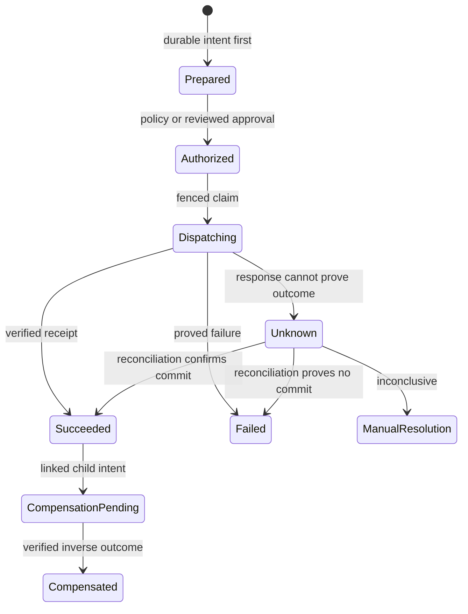
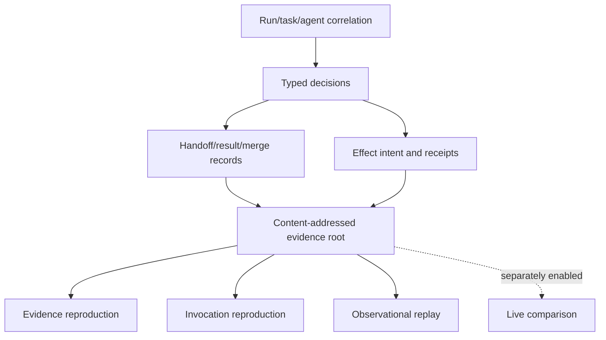

# Honey effects, evidence, and replay

Effects separate a model or agent's proposed action from authorization and execution. Replay uses
sealed records to reconstruct or re-observe a prior run; it never dispatches an effect.



## Durable effect lifecycle

`effect prepare` persists connector, operation, encrypted argument reference, target, preconditions,
result schema, risk, originating decision/bundle, required capability, idempotency scope, retry policy,
and expiry before any external send. Approval is separately attributable. Dispatch requires policy,
capability, approval, expiry, precondition, credential, and fencing checks bound to that intent.

<!-- docs-check: illustrative -->
```sh
cigar effect prepare --input requests/effect-prepare.json --idempotency-key effect-prepare-1 --yes
cigar effect approve "$EFFECT_ID" --input requests/effect-approve.json --idempotency-key effect-approve-1 --expected-revision "$REVISION" --yes
cigar effect dispatch "$EFFECT_ID" --input requests/effect-dispatch.json --idempotency-key effect-dispatch-1 --expected-revision "$REVISION" --yes
cigar effect inspect "$EFFECT_ID" --output json
```

Honey's supported reference effect is local filesystem mediation. HTTPS and arbitrary extensions are
outside the Honey profile.

## `UNKNOWN` is a safety state

If a remote system may have accepted a mutation but CIGAR did not obtain a verifiable receipt, the
durable state becomes `UNKNOWN`. Never turn a transport error into a blind retry. Query by the
original remote idempotency identity and reconcile first. An inconclusive result remains unknown or
requires manual resolution.

<!-- docs-check: illustrative -->
```sh
cigar effect reconcile "$EFFECT_ID" --input requests/effect-reconcile.json --idempotency-key effect-reconcile-1 --expected-revision "$REVISION" --yes
cigar effect compensate "$EFFECT_ID" --input requests/effect-compensate.json --idempotency-key effect-compensate-1 --expected-revision "$REVISION" --yes
```

Compensation is a linked child intent with its own authorization, journal, receipt, and failure state;
it does not erase history or assert that every effect is reversible.

## Evidence and replay modes



- Evidence reproduction verifies the stored record graph and identities without invoking a consumer.
- Invocation reproduction reconstructs the exact bounded input and tool schema from archived inputs.
- Observational replay runs with egress and effect dispatch disabled and records new observations.
- Live comparison invokes a provider under new authority and is explicitly not supported by Honey.

Replay completeness lists source, blob, policy, index, manifest, bundle, tokenizer, adapter, consumer,
tool-schema, and environment dependencies as available or missing. A digest match proves byte or
canonical-record identity, not semantic truth or model quality.

Telemetry is lossy, bounded operational measurement; durable evidence is authoritative workflow
state. Provenance binds a context block to source observations. Evaluation compares behavior against
a task corpus. Honey makes no CIGARBench efficacy claim.
