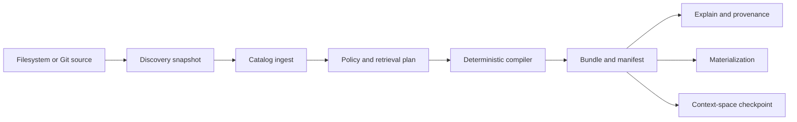

# Honey offline context quickstart

This workflow starts from an empty local repository, uses no model provider, and demonstrates the
chain from source observation to a deterministic, provenance-bearing context bundle. Run it with the
installed `cigar` binary, not a workspace build.



## Initialize and register a source

Use an unprivileged user and an owner-controlled directory. Source identifiers are stable caller
identities, not paths, so moving a checkout does not silently create a new authority domain.

<!-- docs-check: illustrative -->
```sh
mkdir "honey quickstart"
cd "honey quickstart"
printf '# Honey fixture\n' > README.md
cigar --embedded init --dry-run
cigar --embedded init --yes
cigar --embedded source add honey-local "$PWD" --yes
cigar --embedded source list --output json
```

Discovery obeys hard exclusions, `.cigarignore`, Git ignore rules, media and size policy, and source
capabilities. It treats repository text as data; discovered instructions do not become system or
project authority merely because they are present in a file.

## Ingest, query, and compile

Mutation payloads are strict JSON documents supplied with `--input`. Reuse the exact idempotency key
only for the same canonical request. The packaged quickstart fixture contains complete valid request
documents for ingestion, planning, compilation, explanation, materialization, and checkpointing.

<!-- docs-check: illustrative -->
```sh
cigar --embedded ingest --input requests/ingest.json --idempotency-key honey-ingest-1 --yes
cigar --embedded catalog query --input requests/query.json --output json
cigar --embedded context plan --input requests/plan.json --idempotency-key honey-plan-1 --dry-run
cigar --embedded context plan --input requests/plan.json --idempotency-key honey-plan-1 --yes
cigar --embedded context compile --input requests/compile.json --idempotency-key honey-compile-1 --yes
cigar --embedded context explain --input requests/explain.json --output json
cigar --embedded context materialize --input requests/materialize.json --idempotency-key honey-materialize-1 --yes
cigar --embedded focus checkpoint --input requests/checkpoint.json --idempotency-key honey-checkpoint-1 --yes
```

The plan binds purpose, operation class, principal, projects, token lanes, consistency, tokenizer,
materializer, and catalog watermark. The compiler sorts and deduplicates candidates, applies policy
before disclosure, assigns representations and token lanes, and emits content-addressed bundle and
manifest identities. `context explain` reports disposition reasons without revealing denied source
content.

## Verify deterministic identity

Compile the unchanged plan twice from clean process state. The bundle ID, manifest ID, contract
digest, selected block identities, provenance, and physical materialization must agree. After an
authorized source change, request a delta against the exact base and verify that applying the delta
reconstructs the target bundle.

The packaged Honey runner performs this twice under a no-egress boundary and records fixture, driver,
runtime artifact, source tree, seed, assertion, and semantic identity digests.

<!-- docs-check: illustrative -->
```sh
python3 demos/run_honey.py --runtime-archive cigar-0.9.1-honey.1-aarch64-apple-darwin.tar.gz --runtime-sha256 "$RUNTIME_SHA256" --scenario offline-context --output honey-offline-context.json
```

## Read the result correctly

- **Provenance** answers which immutable source observations and transformations support a block.
- **Durable evidence** records what CIGAR authorized and observed about execution.
- **Telemetry** is content-safe operational measurement and is not application truth.
- **Replay** reconstructs or re-executes from sealed evidence; it does not infer missing state.
- **Evaluation** measures quality against a task corpus and is outside the Honey support claim.

CIGAR persists typed records, digests, bounded claims, and explicit decisions. It does not request or
store a model's hidden chain-of-thought. Continue with the [two-agent workflow](honey-two-agent.md).
