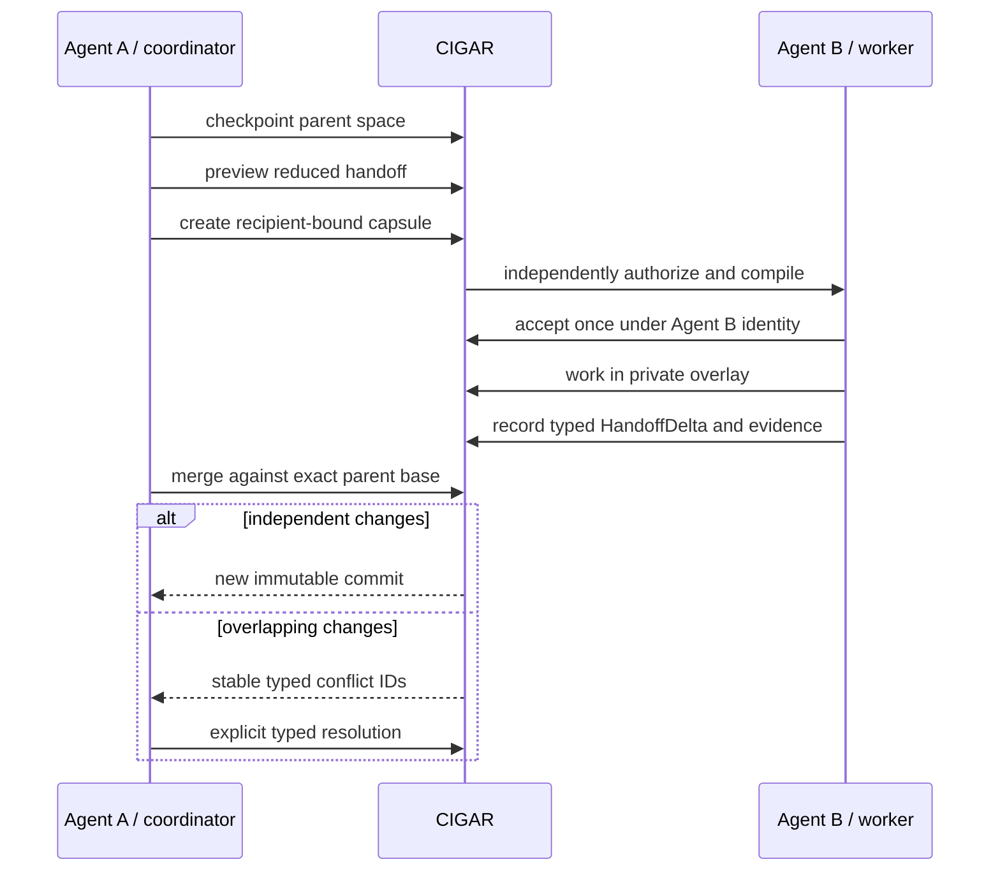

# Honey two-agent coordination

Honey supports a coordinator (Agent A) and one worker (Agent B) through context spaces and signed
handoffs. It does not include an autonomous swarm scheduler. The application decides when to
delegate; CIGAR constrains what crosses the boundary and records what happened.



## Identities and authority

Agent A and Agent B must authenticate as distinct principals. A handoff binds issuer, recipient or
role, audience, tenant, projects, topics, capabilities, budget, nonce, expiry, one-use policy,
references, parent bundle, and signature. The requested grant is intersected with Agent A's current
authority and policy. It can attenuate authority but cannot amplify it.

The capsule carries typed references and a recipient-specific compiled bundle, not an unrestricted
parent transcript. At acceptance, CIGAR reauthorizes every reference under Agent B's current identity
and policy. Revocation, expiry, audience mismatch, replayed nonce, and signature failure fail closed.

## Coordinator flow

Use `--dry-run` to inspect the preview before creating a capsule. Every mutation needs a stable
idempotency key and, where applicable, the exact expected revision.

<!-- docs-check: illustrative -->
```sh
cigar focus checkpoint --input requests/parent-checkpoint.json --idempotency-key agent-a-checkpoint-1 --yes
cigar handoff preview --input requests/handoff-create.json --output json
cigar handoff create --input requests/handoff-create.json --idempotency-key agent-a-to-b-1 --yes
```

The preview exposes accepted and rejected projects/capabilities and reference counts, but not denied
content. Agent A should require the audience, recipient, budget, capabilities, expiry, base bundle,
and signature identity to match the intended delegation before delivering the capsule.

## Worker flow and typed result

Agent B accepts using its own credentials and a fresh target plan. CIGAR compiles a recipient-specific
bundle after acceptance and places work in a worker-owned overlay or fork. Agent B returns bounded
claims with evidence references, decisions, artifacts, source-change references, verifier receipts,
uncertainty, blockers, effect references, and any requested follow-up capabilities. A follow-up
request is not itself a grant.

<!-- docs-check: illustrative -->
```sh
cigar handoff inspect "$HANDOFF_ID" --output json
cigar handoff accept "$HANDOFF_ID" --input requests/handoff-accept.json --idempotency-key agent-b-accept-1 --expected-revision "$HANDOFF_REVISION" --yes
python3 agent_b.py --handoff-id "$HANDOFF_ID" --result requests/agent-b-result.json
```

The Python example uses `record_handoff_result`; Honey's CLI intentionally does not invent a second
wire contract for that generated operation.

## Merge, conflict, and proof of state

Agent A merges the persisted delta against the exact parent base. Independent changes produce a new
content-addressed commit. Overlap produces stable conflict identities; CIGAR never silently chooses
last-writer-wins. The coordinator lists conflicts and submits one closed resolution choice: base,
current, proposed, or a separately persisted typed decision.

<!-- docs-check: illustrative -->
```sh
cigar handoff merge "$HANDOFF_ID" --input requests/handoff-merge.json --idempotency-key agent-a-merge-1 --expected-revision "$PARENT_REVISION" --yes
cigar space conflicts "$SPACE_ID" --output json
```

The resulting evidence graph correlates trace, run, task, Agent A, Agent B, handoff, acceptance,
delta, merge, effect, and verification records. Content-addressed roots and domain-separated SHA-256
identities prove exact record sets and ordering; they do not prove that a model's natural-language
claim is true. Poseidon and zero-knowledge state proofs are deferred until a proof profile needs
field-friendly hashing.

## Required negative checks

The packaged two-agent demo proves distinct recipient binding, content-free denial of an unauthorized
project, rejection of `write_overlay` when only `read_context` was delegated, typed conflict listing,
and explicit resolution against the exact base. The accompanying conformance tests cover replayed
one-use acceptance and stale revision rejection. Run the installed demo twice and require identical
semantic roots; do not substitute a source-tree test result for that installed-artifact receipt.

See [effects and replay](honey-effects-replay.md) for mediated external actions.
