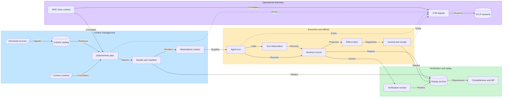

# CIGAR as a Reference Design for Agent Observability and Traceability

Discussion paper for the Agentic AI Foundation (AAIF) Observability & Traceability Working Group

Prepared from the CIGAR repository state on 2026-07-14

## Purpose and position

[AAIF describes the working group's remit](https://aaif.io/working-groups/) as making agent behavior observable, explainable, and traceable across platforms, including execution tracing, cross-system correlation, audit and forensics, and standardized metrics. This paper evaluates CIGAR—the Composable Intelligence Graph Agent Runtime—as a reference design for that remit. It does not ask AAIF to adopt the CIGAR implementation, namespace, storage model, or compiler algorithm wholesale.

The neutral recommendation is to treat CIGAR as an implementation-informed source of separable standards candidates. Its most relevant contribution is a bridge between:

1. **Operational telemetry**, which answers what ran, where, for how long, and with what operational result; and
2. **Durable semantic evidence**, which answers what governed the run, what context was selected, what the agent observed, what external effects were attempted, what was verified, and what can be reproduced.

This distinction matters because a distributed trace can correlate calls without proving which version of a policy, source, context bundle, tool schema, or effect intent governed a decision. Conversely, an evidence archive without trace correlation is difficult to operate across vendors and services. CIGAR's method is to link the two planes without placing protected prompts or source content in ordinary telemetry.

## Executive summary

CIGAR organizes an agent workflow around explicit, versioned records:

- A **context contract** declares the job, scope, purpose, target, constraints, and token budget.
- A **deterministic plan** pins the catalog and policy state and records a disposition for every context candidate.
- A **bundle and selection manifest** bind the exact context supplied to the agent and explain selection, exclusion, redaction, transformation, provenance, and token cost.
- A **materialization** binds the bundle to provider-ready bytes and exact tokenizer and renderer fingerprints.
- A **decision record** links observable task, plan, context, runtime, outputs, claims, evidence, uncertainty, verification, effects, usage, timing, and outcome. It deliberately excludes hidden chain-of-thought.
- An **intent-first effect journal** records proposed external mutations before dispatch, makes ambiguous outcomes explicit, and links attempts to receipts and reconciliation evidence.
- A **replay archive** reports which dependencies are available or missing and separates context/compiler differences from model, tool, or provider variance.

The design is valuable to observability because context becomes an observable input with lineage rather than an opaque prompt side effect. It is valuable to traceability because every material transition can be connected through stable identifiers and digests. It is potentially efficient because deterministic selection, exact budgeting, content-addressed caches, delta compilation, and recorded-observation replay avoid repeated model calls and unnecessary context movement. Those mechanisms are implemented or specified in CIGAR, but broad production and cross-vendor efficiency claims are not yet independently qualified.

The recommended AAIF path is therefore:

1. standardize a small correlation and evidence model rather than a runtime;
2. align telemetry names and transport with W3C Trace Context and OpenTelemetry;
3. define portable context-selection, effect-receipt, verification, and replay-completeness artifacts;
4. require privacy-safe defaults, independent implementations, golden vectors, and adversarial conformance tests before calling the result a standard.

## How CIGAR works

The following conceptual diagram shows the end-to-end reference workflow, not the feature surface of the current beta distribution. Solid arrows represent semantic or execution dependencies. Dotted arrows represent operational telemetry emitted about the flow. The diagram is also available as [standalone Mermaid source](aaif-cigar-evidence-flow.mmd) and an [editable FigJam board](https://www.figma.com/board/CMkcLKn2xKxnwmeMIVeItv).

### 1. Context is made explicit before execution

CIGAR ingests source material as versioned context atoms with source, temporal, governance, quality, lifecycle, and integrity metadata. A job does not ask for an unbounded prompt; it supplies a context contract. Planning then freezes the relevant catalog watermark, policy, indexes, compiler profile, target, and budget.

The compiler applies authorization before protected content is loaded or transformed, reconciles duplicates, supersession, temporal validity, and conflicts, closes dependencies, selects representations, and packs them under an exact token budget. The output is both a context bundle and a selection manifest. The bundle says what the consumer received; the manifest says why each considered item was selected, excluded, redacted, or displaced.

This path is described in the [product specification](../../prd.md#102-deterministic-compilation-path) and represented by concrete protocol types in [`compilation.rs`](../../crates/cigar-protocol/src/compilation.rs) and generated [JSON Schemas](../../schemas/json/selection-manifest-v1.schema.json).

### 2. Execution produces observable evidence, not hidden reasoning

CIGAR's decision record binds the observable task digest, plan, bundle, materialization, runtime and consumer fingerprints, output artifacts, asserted claims, supporting evidence, uncertainty, verification receipts, effects, usage, timing, and result. Hidden chain-of-thought is intentionally neither required nor stored. This is a useful standards boundary: interoperable auditability should be based on observable inputs, outputs, actions, policies, and evidence, not on access to a model's private reasoning representation.

The implemented record is defined in [`replay.rs`](../../crates/cigar-protocol/src/replay.rs) and documented in [replay records v1](../../spec/context-abi/replay-records-v1.md).

### 3. External actions are intent-first and ambiguity is visible

Before an external mutation, CIGAR records an effect intent containing the normalized argument digest, protected argument reference, target, preconditions, risk, source decision and bundle, required capability, idempotency scope, retry policy, expiry, and optional compensation. Dispatch begins only after a durable state transition. A timeout or lost response becomes `unknown` unless non-execution can be proved; it is not silently converted to success or blindly retried.

The journal is append-only and hash-chained. Receipts and reconciliation evidence bind later observations to the original intent. These records are implemented in [`effect.rs`](../../crates/cigar-protocol/src/effect.rs), with the state and connector behavior documented in [effect records v1](../../spec/context-abi/effect-records-v1.md).

### 4. Replay distinguishes missing evidence from changed behavior

CIGAR defines four replay modes: evidence reproduction, invocation reproduction, observational replay using recorded responses, and a separately authorized live comparison. Replay completeness names available and missing dependency categories. A replay diff compares semantic context, materialization, components, output claims, verification, effect plan, and observations independently.

That separation prevents model or provider variance from being mislabeled as compiler nondeterminism. Non-live replay is designed to deny network egress and effect dispatch, and to fail rather than fall through to current dependencies. The design and current implementation are summarized in the [`cigar-replay` README](../../crates/cigar-replay/README.md).

## Why context management is an observability concern

Traditional application traces usually identify a request, service, database call, and error. In an agent workflow, that is necessary but insufficient. Two runs can have the same model, tool, and code path but behave differently because they received different instructions, source revisions, retrieved facts, policy decisions, token budgets, or compressed representations.

CIGAR treats context as a first-class observable dependency:

| Question for an operator or auditor | CIGAR evidence |
| --- | --- |
| What was the agent asked to do? | Normalized context contract and task digest |
| What source and policy state governed the run? | Catalog watermark, policy digest, component fingerprints |
| What information was considered? | Plan candidate table and manifest entries |
| Why was an item included or omitted? | Stable disposition and reason codes |
| What exact context reached the provider? | Bundle ID, materialization digest, tokenizer and materializer fingerprints |
| Was context stale, conflicted, transformed, or invalidated? | Lifecycle, provenance, conflict, transform receipt, and revalidation conditions |
| What changed between two executions? | Replay diff across semantic and observational dimensions |
| Can another agent safely continue the work? | Signed, scoped handoff references and recipient-specific acceptance receipt |

This has four practical benefits:

- **Root-cause isolation:** operators can separate retrieval, authorization, packing, tool, provider, and verification failures.
- **Auditability without prompt dumping:** ordinary telemetry can contain stable IDs and safe counts while protected bytes remain in controlled evidence storage.
- **Change impact:** content-addressed dependencies allow invalidation and revalidation when a source, policy, index, transform, or component changes.
- **Cross-agent continuity:** handoffs carry typed references, scope, capability attenuation, and acceptance evidence instead of copying unrestricted transcripts.

## Observability model: two planes joined by correlation

### Operational telemetry plane

This plane uses traces, metrics, and logs for live operations. CIGAR accepts W3C-compatible `traceparent` identifiers at HTTP and gRPC boundaries, returns a correlation identifier, exposes bounded OpenMetrics, and has a daemon OTLP/gRPC exporter. The daemon metric plane implements the complete closed PRD catalog as 43 families and at most 137 series from one shared schema, with owning-subsystem instrumentation and exact local/OTLP parity. The current span instrumentation remains intentionally narrower. See [`context.rs`](../../crates/cigar-api/src/context.rs), [`http.rs`](../../crates/cigar-api/src/http.rs), [`lib.rs`](../../crates/cigar-observe/src/lib.rs), and [`telemetry.rs`](../../crates/cigar-daemon/src/telemetry.rs).

The broader trace tree in [PRD section 23](../../prd.md#231-trace-tree)—planning, retrieval, authorization, reconciliation, materialization, tool observation, handoff, decision capture, effect lifecycle, and outcome verification—should be read as the intended semantic instrumentation profile, not as fully implemented coverage.

### Durable evidence plane

This plane holds versioned manifests, decisions, journal events, receipts, verification results, and replay dependencies. Records use bounded schemas, closed security-sensitive enums, deterministic serialization, domain-separated content digests, and explicit versioning. Unlike sampled spans, required audit evidence should be retained according to policy and must report incompleteness rather than silently disappear.

### Correlation bridge

A standards profile should link the planes without making either one carry the other's payload:

- W3C Trace Context identifies the distributed execution path.
- Span links represent fan-out, fan-in, asynchronous work, handoffs, and replay relationships.
- Span attributes reference durable contract, plan, bundle, manifest, materialization, decision, effect, receipt, and verification identifiers.
- The evidence records optionally retain the originating trace and span references as non-semantic observation fields, so a trace sampling decision does not change record identity.
- High-cardinality record identifiers belong on spans or logs, not metric labels.
- Prompt, response, source, path, user, secret, and protected tool data are absent by default. W3C Baggage should not be used as a covert content or authorization channel.

## Where CIGAR may be efficient

CIGAR's efficiency argument is architectural, not yet a broadly qualified benchmark claim:

- **Deterministic default compilation:** context selection and packing do not require a model call. Generative summaries are eligible only as pre-existing, evidence-carrying derived records.
- **Budget before execution:** mandatory context and dependencies are proven feasible before optional material is packed, reducing overflow and retry cycles.
- **Content addressing:** plans, bundles, transforms, materializations, decisions, and receipts are reusable only when their exact dependencies match.
- **Delta compilation:** unchanged authorized blocks can be reused while additions, removals, and replacements are transmitted explicitly.
- **Provider-present accounting:** adapters may avoid resending optional context that is demonstrably still present, while invalidating that assumption after compaction or session change.
- **Evidence references instead of telemetry payloads:** operational signals remain small and content-safe; detailed artifacts are fetched only when authorized and needed.
- **Recorded-observation replay:** diagnosis can reproduce an invocation or consume recorded tool/provider observations without new provider cost, network access, or external effects.

The repository specifies outcome gates such as context reduction, context precision, verified task success, and cost per verified success, but the [implementation status](../../IMPLEMENTATION_STATUS.md) states that the broader GA performance, independent evaluation, release, and installed-artifact qualification remain incomplete. A standards proposal should therefore claim testable mechanisms, not proven ecosystem-wide savings, until independent results exist.

## Alignment with existing standards

AAIF should avoid creating a parallel observability transport or incompatible agent trace vocabulary.

| Existing standard or project | Role | Proposed CIGAR relationship |
| --- | --- | --- |
| [W3C Trace Context](https://www.w3.org/TR/trace-context/) | Portable `traceparent` and `tracestate` propagation | Use directly for distributed correlation |
| [W3C Baggage](https://www.w3.org/TR/baggage/) | Propagation of application-defined properties | Use sparingly for safe routing context; prohibit protected content and authorization grants |
| [OpenTelemetry](https://opentelemetry.io/docs/specs/otel/) and [OTLP](https://opentelemetry.io/docs/specs/otlp/) | Vendor-neutral signals, SDK model, collector transport | Export traces, metrics, and logs through OTLP; define only agent-specific semantic additions |
| [OpenTelemetry GenAI semantic conventions](https://github.com/open-telemetry/semantic-conventions-genai) | Agent, model, tool, MCP, metric, and event vocabulary under active development | Reuse applicable names; propose context-manifest and durable-evidence gaps upstream rather than fork them |
| [W3C PROV-O](https://www.w3.org/TR/prov-o/) | Entity, Activity, Agent, use, generation, derivation, and responsibility model | Publish a mapping from CIGAR records to a general provenance model |
| [CloudEvents](https://cloudevents.io/) | Portable event envelope | Candidate envelope for invalidation, handoff, effect-state, and policy-change notifications |
| [MCP governance and SEP process](https://github.com/modelcontextprotocol/modelcontextprotocol/issues/932) | Open process for MCP protocol changes | Route MCP-specific correlation or task-lifecycle changes through MCP governance |

OpenTelemetry GenAI conventions are still evolving. Any AAIF profile should pin a schema URL or convention version, supply explicit transformation rules, and avoid prematurely standardizing competing names.

## Modular standards candidates

The following pieces can be evaluated independently. Neutral standard names should replace the `cigar.*` namespace if adopted.

| Candidate | Minimum portable content | Why it matters |
| --- | --- | --- |
| **Agent execution correlation profile** | W3C trace context, span-link rules, session/job/turn relationships, stable error class, references to durable evidence IDs | Correlates multi-service and multi-agent work without choosing a backend |
| **Context selection manifest** | Contract fingerprint, source/catalog watermark, policy and compiler fingerprints, every considered reference, selection disposition, reason, provenance, transform, exact token cost, invalidation condition | Makes retrieved context explainable and auditable across runtimes |
| **Observable decision envelope** | Task digest, context and component references, claims, evidence, uncertainty, outputs, verification, effects, usage, timing, outcome | Defines auditable behavior without requiring chain-of-thought |
| **Effect intent and receipt profile** | Normalized intent digest, source decision/context, capability and approval references, idempotency scope, attempt, state, response/verification digest, ambiguity and reconciliation status | Makes externally consequential actions traceable and safe under partial failure |
| **Replay completeness and diff profile** | Requested mode, exact dependency inventory, missing categories, reconstructed input and observation digests, semantic-versus-observational diff dimensions | Prevents partial or live-fallback replays from being reported as faithful reproduction |
| **Conformance evidence profile** | Implementation and runner digest, claimed profile, vector set, platform, isolation, case results, expected/actual public digest, redacted diagnostics | Turns interoperability claims into independently executable evidence |

The full context packing heuristic, database schema, crate structure, deployment topology, provider adapter, model choice, and CIGAR brand should remain implementation choices. A standard should define observable contracts and invariants, not require one orchestration architecture.

## Candidate metrics and privacy rules

A first metrics profile should prefer distributions and bounded dimensions over per-agent or per-record labels.

| Domain | Candidate measurements |
| --- | --- |
| Context | plan and compile duration; candidates considered, authorized, selected, redacted, stale, conflicted; exact selected tokens; cache and delta reuse; invalidation age |
| Execution | agent turns; model and tool operation duration; cancellation and error class; input, output, and cached tokens using existing OTel GenAI conventions |
| Effects | intents by closed risk class; attempts; state; unknown age; reconciliation duration and outcome; compensation outcome |
| Coordination | handoff acceptance, rejection class, time to first productive action, merge conflict class |
| Verification and replay | verification outcome; replay mode and status; missing dependency count by closed category; semantic or observational difference class |
| Operations | request admission, queue depth and age, backpressure, dependency health, resource saturation, exporter loss |

Normative privacy requirements should include:

- content capture off by default;
- no raw prompt, response, source, path, artifact, principal, or secret in metric labels;
- protected values represented by scoped or blinded identifiers, digests, counts, and closed categories;
- disclosure policy applied again when an explanation or evidence artifact is read;
- telemetry retention and evidence retention specified separately;
- an explicit record when required telemetry or evidence was dropped, sampled, expired, or unavailable;
- no use of signatures, trace propagation, or baggage as a substitute for authorization.

## Proposed AAIF adoption workflow

[AAIF's public governance update](https://aaif.io/blog/aaifs-first-quarter-success-story-new-members-technical-wins-and-open-governance/) states that working groups develop proposals for the Technical Committee and Governing Board. AAIF also publishes a [separate project-intake path](https://aaif.io/blog/how-to-submit-your-project-to-the-aaif/) in which the Technical Committee reviews project health and accepted projects onboard to Linux Foundation standards. This paper recommends a standards contribution before, and independently of, any decision to submit CIGAR as a hosted project.

### Phase 1: Establish the problem and terminology

Collect a small set of cross-vendor use cases: multi-agent handoff, retrieved-context failure, external effect with lost response, policy change during a job, and offline incident replay. Agree on the distinction between telemetry, audit evidence, provenance, evaluation, replay, and hidden reasoning.

**Exit:** WG-approved use cases, non-goals, threat model, privacy model, and glossary.

### Phase 2: Perform a standards gap analysis

Map each field and operation to W3C Trace Context, OpenTelemetry GenAI, OTLP, CloudEvents, W3C PROV, and MCP. Remove duplicates and route changes to the standards body that owns the relevant layer.

**Exit:** public gap matrix and ownership decision for each proposed artifact or attribute.

### Phase 3: Draft a minimal, non-branded profile

Specify correlation rules and the smallest useful context manifest, decision, effect receipt, verification, and replay completeness envelopes. Publish normative JSON Schema or Protobuf, canonical examples, privacy constraints, compatibility rules, and mappings to OTel and PROV.

**Exit:** versioned draft with no dependency on CIGAR code or storage.

### Phase 4: Require independent implementations

Implement the draft in CIGAR and at least two independent agent stacks, with at least two programming languages and more than one telemetry backend. Include an adapter for an AAIF project such as MCP or goose where technically appropriate.

**Exit:** three interoperable producers/consumers and documented implementation differences.

### Phase 5: Run interoperability and adversarial conformance

Publish golden vectors and negative cases for canonicalization, trace and span links, missing evidence, redaction, high-cardinality controls, schema downgrade, context tampering, ambiguous effects, replay fallback, and unauthorized disclosure. Run a public plugfest.

**Exit:** independently reproducible conformance results with no required case skipped.

### Phase 6: Standardize through the proper governance route

- Submit telemetry semantic additions to the OpenTelemetry GenAI conventions process.
- Submit MCP-specific protocol changes through the MCP SEP process.
- Submit protocol-neutral evidence artifacts through the AAIF WG-to-TC/Governing Board path selected by AAIF governance.
- Use AAIF project intake only if CIGAR itself is proposed as a hosted implementation project.

**Exit:** accepted ownership, maintainer group, versioning policy, compatibility window, security response process, and release cadence.

## Suggested interoperability pilot

A small pilot can test the proposal without adopting the CIGAR runtime:

1. Agent A receives a versioned context contract and emits a selection manifest.
2. Agent A hands work to Agent B on another runtime using W3C trace links and typed evidence references.
3. Agent B proposes an external effect; the test service commits but loses the response.
4. The effect becomes explicitly unknown, is reconciled without duplicate mutation, and receives a verification receipt.
5. A third implementation performs offline replay with one dependency deliberately removed.

The pilot passes only if:

- all systems preserve cross-system correlation;
- the manifest explains every selected and excluded test item;
- telemetry contains no protected canary content;
- independent implementations compute the same agreed digests;
- the external effect is not falsely reported as failed or safely retryable;
- replay reports the exact missing dependency and does not call a live provider;
- verification and effect evidence can be reached from the trace without embedding that evidence in the trace.

## Current CIGAR maturity and limitations

The repository contains substantial implementation and test material for protocol records, context compilation, handoff, effects, replay, APIs, trace propagation, OTLP export, OpenMetrics, and conformance vectors. The current [conformance result](../../reports/conformance-result.v1.json) reports 24 required cases passed across eight CIGAR profiles, and the [traceability result](../../reports/invariant-traceability.v1.json) reports 35 mapped requirements and 17 tests.

Those artifacts are useful prototype evidence, not proof of an interoperable standard:

- They are produced by the CIGAR project rather than multiple independent implementations.
- The traceability registry is explicitly curated and incomplete relative to the full product specification.
- The conformance artifact's bounded `release_qualified` field must not be read as broader product release qualification; [`IMPLEMENTATION_STATUS.md`](../../IMPLEMENTATION_STATUS.md) records open GA, performance, security, platform, installed-artifact, and release gates.
- The initial beta distribution deliberately exposes only workspace-state administration and excludes context compilation, daemon, effects, replay, SDK, MCP, and OTLP surfaces.
- The complete semantic trace tree is broader than the spans currently instrumented. The daemon metric catalog is implemented; shared PostgreSQL pool observations remain owned by the FULL-500 profile, and benchmark outcomes remain signed evidence rather than daemon labels.
- The efficiency and outcome targets remain claims to test, not independent ecosystem results.

These limitations support a staged standards process: use CIGAR to supply concrete schemas, invariants, negative cases, and a reference implementation, while requiring independent implementation and neutral governance before adoption.

## Recommendation

The AAIF Observability & Traceability Working Group should consider CIGAR as a source of testable design patterns, particularly the context selection manifest, intent-first effect evidence, replay completeness, and the separation of sampled telemetry from durable semantic evidence.

The first standards deliverable should be a small **agent execution evidence correlation profile** that:

1. reuses W3C Trace Context and OpenTelemetry transport and conventions;
2. defines links from spans to portable context, decision, effect, verification, and replay artifacts;
3. specifies content-safe and bounded telemetry defaults;
4. provides neutral schemas and PROV mappings for the durable artifacts; and
5. ships with executable conformance vectors and at least three independent implementations.

This path captures CIGAR's core value without coupling AAIF to a single runtime or prematurely ratifying an unqualified implementation.

## Primary references

- AAIF, [Working Groups](https://aaif.io/working-groups/), accessed 2026-07-14.
- AAIF, [First Quarter Success Story: New Members, Technical Wins, and Open Governance](https://aaif.io/blog/aaifs-first-quarter-success-story-new-members-technical-wins-and-open-governance/), accessed 2026-07-14.
- AAIF, [How to Submit your Project to the AAIF](https://aaif.io/blog/how-to-submit-your-project-to-the-aaif/), accessed 2026-07-14.
- W3C, [Trace Context](https://www.w3.org/TR/trace-context/).
- W3C, [Propagation format for distributed context: Baggage](https://www.w3.org/TR/baggage/).
- W3C, [PROV-O: The PROV Ontology](https://www.w3.org/TR/prov-o/).
- OpenTelemetry, [OpenTelemetry Specification](https://opentelemetry.io/docs/specs/otel/), [OTLP Specification](https://opentelemetry.io/docs/specs/otlp/), and [GenAI Semantic Conventions](https://github.com/open-telemetry/semantic-conventions-genai).
- Cloud Native Computing Foundation, [CloudEvents](https://cloudevents.io/).
- CIGAR, [product specification](../../prd.md), [implementation status](../../IMPLEMENTATION_STATUS.md), and [protocol schemas](../../schemas/README.md).
